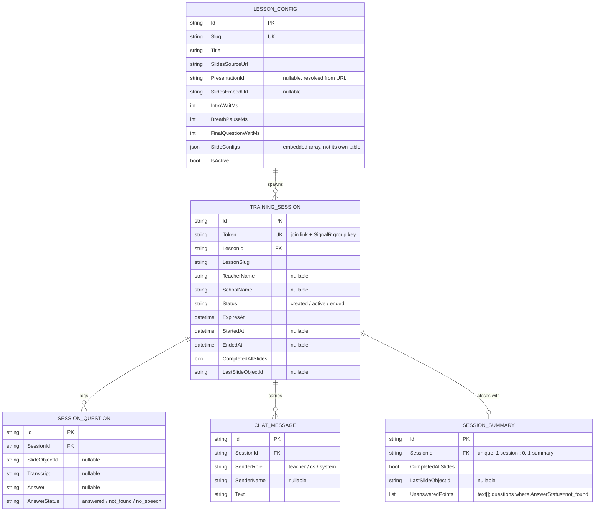
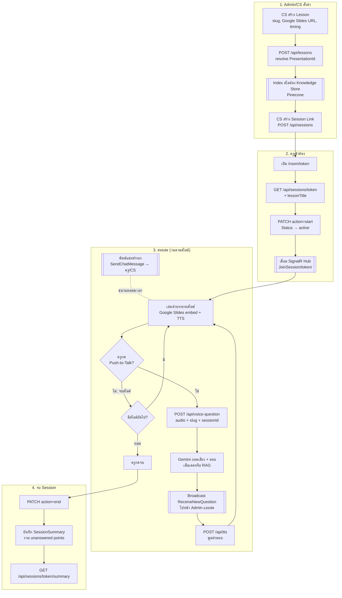
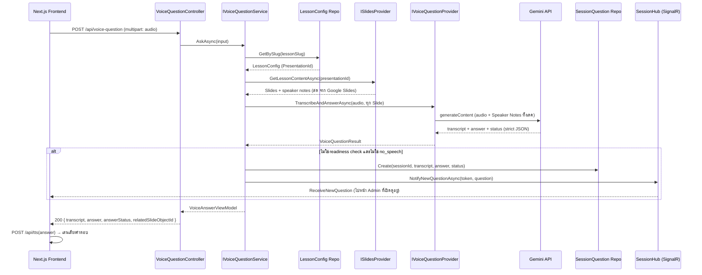
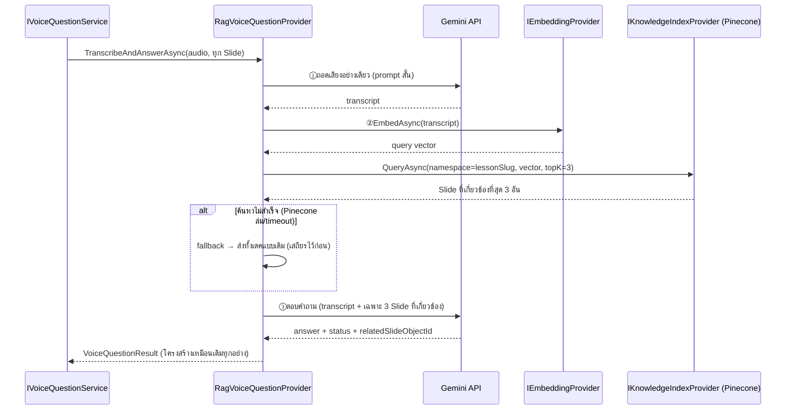
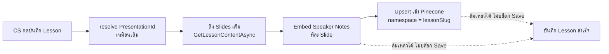
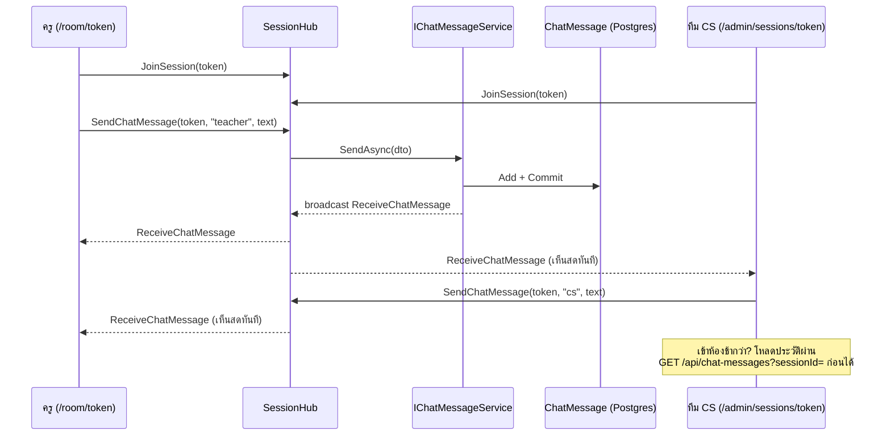

# SB_Ai_Supportroom — ER Diagram & Workflow

โครงสร้างข้อมูลและลำดับการทำงานของระบบ (.NET backend) — รวม Real-time Chat (SignalR, verify แล้ว)
และ RAG ด้วย Pinecone (implement + verify แล้วกับเสียงจริง/Gemini จริง/Pinecone จริง — ทุก Provider
เป็น Real ทั้งหมดแล้ว ไม่มี Mock อีกต่อไป)

## ER Diagram

5 ตารางใน Postgres: `LessonConfig` เป็นต้นทาง สร้าง `TrainingSession` ได้หลายอัน แต่ละ Session มี
`SessionQuestion` (Push-to-Talk log) และ `ChatMessage` (พิมพ์คุยสด) หลายแถว และปิดท้ายด้วย
`SessionSummary` หนึ่งแถว (เขียนตอน end เท่านั้น)

**หมายเหตุ**
- `SlideConfigs` ไม่ใช่ตารางแยก — เก็บเป็น `text[]`/JSON ฝังอยู่ใน `LessonConfig` เอง (ตาม EF Core native `List<T>` → Postgres array mapping)
- เนื้อหาสไลด์จริง (speaker notes, รูป/วิดีโอ) **ไม่ persist ซ้ำ** — ดึงสดจาก Google Slides ทุกครั้งผ่าน `ISlidesProvider`, `LessonConfig` เก็บแค่ metadata/timing
- `SessionSummary.UnansweredPoints` ไม่ได้ join คำถามทั้งหมดมาเก็บซ้ำ — list คำถามจริงถูก re-join จาก `SessionQuestion` ด้วย `SessionId` ตอนอ่าน (`GetBySessionId`)
- **`ChatMessage` เขียนได้ทาง SignalR Hub เท่านั้น** ไม่มี public POST (เหมือน `SessionQuestion`) — REST มีแค่ `GET /api/chat-messages?sessionId=` สำหรับโหลดประวัติ
- **Pinecone** ไม่ใช่ตารางใน Postgres — เป็น Vector Store แยกภายนอก เก็บ embedding ของ Speaker Notes ต่อ Slide โดย namespace = `LessonConfig.Slug` เชื่อมกันทาง Slug ไม่ใช่ FK ในฐานข้อมูลเดียวกัน (`SupportRoom.Providers.Knowledge`)

## Workflow — ภาพรวมทั้งระบบ

จาก CS สร้างบทเรียน ไปจนจบ Session และสรุปผล — มี Real-time Chat วิ่งขนานอยู่ตลอดตั้งแต่เข้าห้องจนจบ

## Workflow — Voice Q&A Pipeline (Full Context — `VOICE_QUESTION_PROVIDER=gemini`)

รายละเอียดทางเทคนิคของ 1 คำถามเสียง — ส่ง Speaker Notes ทั้งเดคเข้า Gemini ทุกครั้ง (verify แล้ว)

## Workflow — Voice Q&A Pipeline (RAG — `VOICE_QUESTION_PROVIDER=gemini-rag`)

Implement และทดสอบกับเสียงจริง + Gemini จริง + Pinecone จริงแล้ว (ผลถูกต้อง 100% ในทุกเคสที่ทดสอบ)
เลือกใช้ผ่าน env var เดียว contract หน้าบ้านเหมือนเดิมทุกอย่าง ไม่ต้องแก้ frontend แยกเป็น 3 ขั้น
เพราะต้องรู้คำถามก่อนถึงจะค้นหาส่วนที่เกี่ยวข้องได้

## Workflow — RAG Indexing (implement แล้ว — ตอน CS บันทึก Lesson)

Index สไลด์ใหม่ทุกครั้งที่ CS กดบันทึก Lesson — ไม่ต้องมีปุ่ม Sync แยก ไม่บล็อกการบันทึกถ้า index พัง

## Workflow — Real-time Chat (SignalR, verify แล้ว)

แชทสำรองสองทางระหว่างครูกับทีม CS ผ่าน `SessionHub` — group key คือ `TrainingSession.Token`

