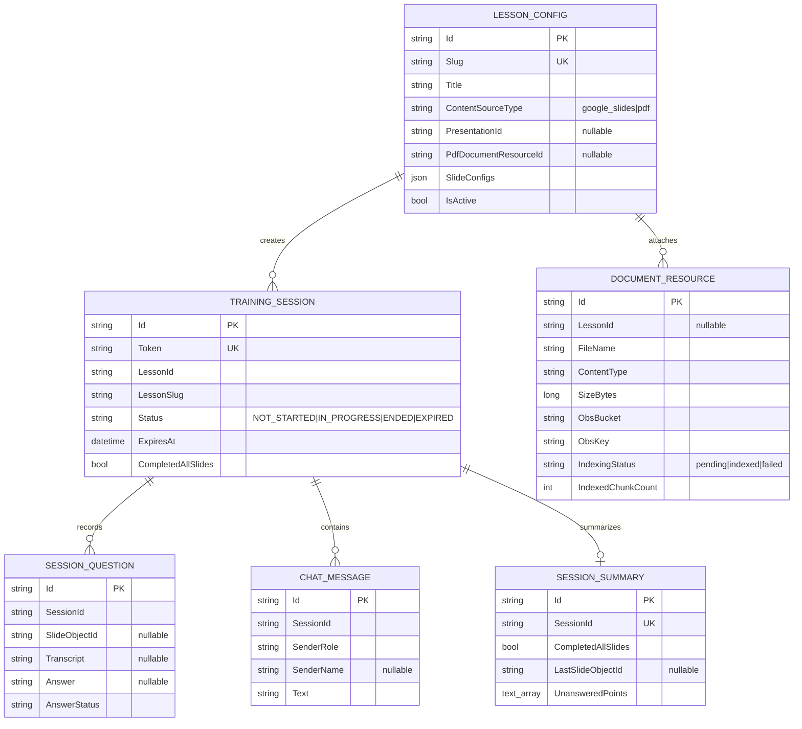
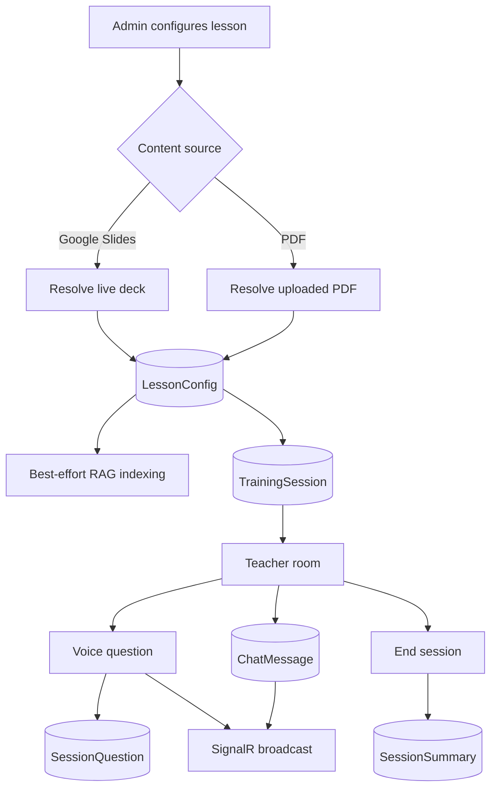
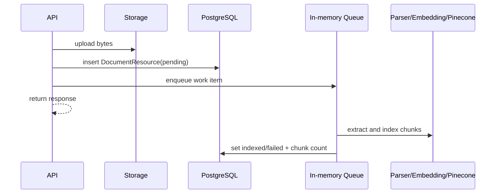

# SupportRoom Backend — ER Diagram and Workflow

> Source of truth: `ApplicationDbContext`, entities และ EF Core migrations ใน
> `backend/src/SupportRoom.Providers.Data/`

## ER Diagram



ความสัมพันธ์บางส่วนใช้ string IDs โดยไม่มี database FK navigation กำกับใน `OnModelCreating`;
diagram แสดงความสัมพันธ์เชิง domain ที่ services/repositories ใช้

## Data Ownership

- `LessonConfig.SlideConfigs` เป็น EF owned collection เก็บเป็น JSON
- Google Slides/PDF content ไม่ถูก snapshot ลงตาราง lesson
- PDF/knowledge file bytes อยู่ใน storage; `DocumentResource` เก็บ metadata/pointer
- Pinecone อยู่นอก PostgreSQL และ partition ด้วย lesson slug หรือ `kb-global`
- Summary เก็บ unanswered points; question records อ่านแยกตาม session ID

## Main Workflow



## Document Indexing Workflow



Queue ปัจจุบันไม่ durable; restart ก่อนประมวลผลเสร็จอาจทิ้ง row เป็น `pending`

## Voice RAG Workflow

1. Gemini transcribes audio
2. Embedding provider สร้าง query vector
3. Pinecone query ทั้ง lesson namespace และ `kb-global`
4. Merge top-K และกรองด้วย minimum score
5. Gemini หรือ OpenAI-compatible model สร้าง grounded answer
6. Persist question และ broadcast `ReceiveNewQuestion`

Full-context `VOICE_QUESTION_PROVIDER=gemini` ข้ามขั้น embedding/query และส่ง lesson context
ให้ Gemini โดยตรง

## Schema Changes

สร้าง migration ใหม่เสมอ:

```powershell
dotnet ef migrations add <Name> --project src/SupportRoom.Providers.Data --startup-project src/SupportRoom.Api
dotnet ef database update --project src/SupportRoom.Providers.Data --startup-project src/SupportRoom.Api
```
