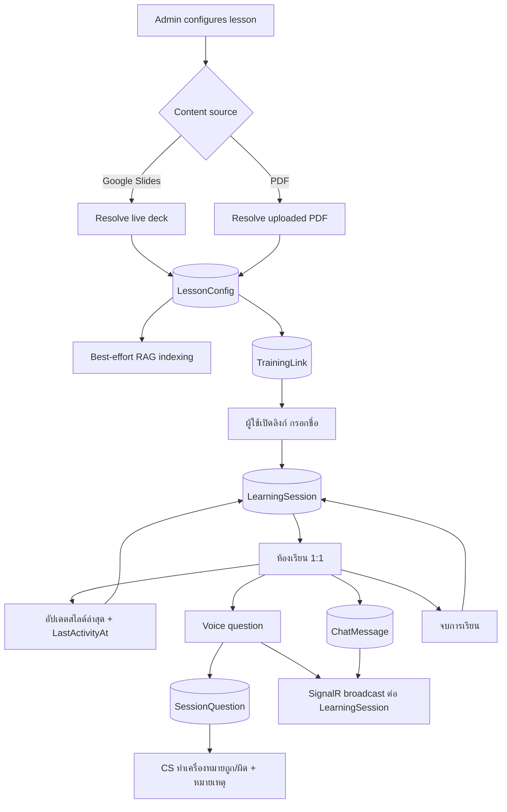
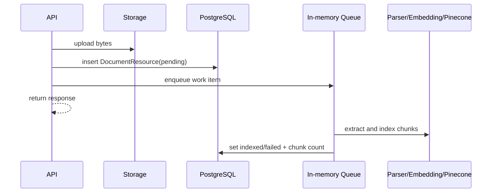

# SupportRoom Backend — ER Diagram and Workflow

> Source of truth: `ApplicationDbContext`, entities และ EF Core migrations ใน
> `backend/src/SupportRoom.Providers.Data/`

## ER Diagram

```mermaid
erDiagram
    LESSON_CONFIG ||--o{ TRAINING_LINK : creates
    LESSON_CONFIG ||--o{ DOCUMENT_RESOURCE : attaches
    TRAINING_LINK ||--o{ LEARNING_SESSION : "opened by many people"
    LEARNING_SESSION ||--o{ SESSION_QUESTION : records
    LEARNING_SESSION ||--o{ CHAT_MESSAGE : contains

    LESSON_CONFIG {
        string Id PK
        string Slug UK
        string Title
        string ContentSourceType "google_slides|pdf"
        string PresentationId "nullable"
        string PdfDocumentResourceId "nullable"
        json SlideConfigs
        bool IsActive
    }

    TRAINING_LINK {
        string Id PK
        string Token UK
        string LessonId
        string LessonSlug
        string RecipientOrgName "nullable"
        datetime ExpiresAt
        int MaxAttendees "nullable, ยังไม่บังคับใช้"
    }

    LEARNING_SESSION {
        string Id PK
        string TrainingLinkId
        string LearnerKey "key ที่ browser เก็บ - แยกคนบนลิงก์เดียวกัน + กลับมาเรียนต่อ"
        string RecipientName "ผู้ใช้กรอกเอง"
        string Status "IN_PROGRESS|ENDED"
        datetime StartedAt
        datetime EndedAt "nullable"
        datetime LastActivityAt "ใช้คำนวณ หยุดกลางคัน"
        string LastSlideObjectId "nullable"
        int LastSlideIndex
        bool CompletedAllSlides
    }

    SESSION_QUESTION {
        string Id PK
        string SessionId "→ LEARNING_SESSION.Id
        string SlideObjectId "nullable"
        string Transcript "nullable"
        string Answer "nullable"
        string AnswerStatus
        string ReviewResult "nullable: correct|incorrect"
        string ReviewNote "nullable, free text"
        datetime ReviewedAt "nullable"
    }

    CHAT_MESSAGE {
        string Id PK
        string SessionId "→ LEARNING_SESSION.Id
        string SenderRole
        string SenderName "nullable"
        string Text
    }


    DOCUMENT_RESOURCE {
        string Id PK
        string LessonId "nullable"
        string FileName
        string ContentType
        long SizeBytes
        string ObsBucket
        string ObsKey
        string IndexingStatus "pending|indexed|failed"
        int IndexedChunkCount
    }
```

ความสัมพันธ์บางส่วนใช้ string IDs โดยไม่มี database FK navigation กำกับใน `OnModelCreating`;
diagram แสดงความสัมพันธ์เชิง domain ที่ services/repositories ใช้

## Data Ownership

- `LessonConfig.SlideConfigs` เป็น EF owned collection เก็บเป็น JSON
- Google Slides/PDF content ไม่ถูก snapshot ลงตาราง lesson
- PDF/knowledge file bytes อยู่ใน storage; `DocumentResource` เก็บ metadata/pointer
- Pinecone อยู่นอก PostgreSQL และ partition ด้วย lesson slug หรือ `kb-global`
- **ไม่มีตาราง summary แล้ว** (TD-013) — สรุปการเรียนถูกคำนวณสดตอนอ่านจาก `LearningSession`
  + `SessionQuestion`; `unansweredPoints` = คำถามที่ `AnswerStatus = not_found`
- 1 `TrainingLink` มีได้หลาย `LearningSession` และคนหนึ่งคนมีได้หลายรอบ (กด "เรียนอีกครั้ง")
- "หยุดกลางคัน" ไม่ใช่คอลัมน์ — คำนวณจาก `LastActivityAt` เทียบ `INACTIVE_THRESHOLD_MINUTES`

## Main Workflow



## Document Indexing Workflow



Queue ปัจจุบันไม่ durable; restart ก่อนประมวลผลเสร็จอาจทิ้ง row เป็น `pending`

## Voice RAG Workflow

1. Gemini transcribes audio
2. Embedding provider สร้าง query vector
3. Pinecone query ทั้ง lesson namespace และ `kb-global`
4. Merge top-K และกรองด้วย minimum score
5. Gemini หรือ OpenAI-compatible model สร้าง grounded answer
6. Persist question และ broadcast `ReceiveNewQuestion`

Full-context `VOICE_QUESTION_PROVIDER=gemini` ข้ามขั้น embedding/query และส่ง lesson context
ให้ Gemini โดยตรง

## Schema Changes

สร้าง migration ใหม่เสมอ:

```powershell
dotnet ef migrations add <Name> --project src/SupportRoom.Providers.Data --startup-project src/SupportRoom.Api
dotnet ef database update --project src/SupportRoom.Providers.Data --startup-project src/SupportRoom.Api
```
