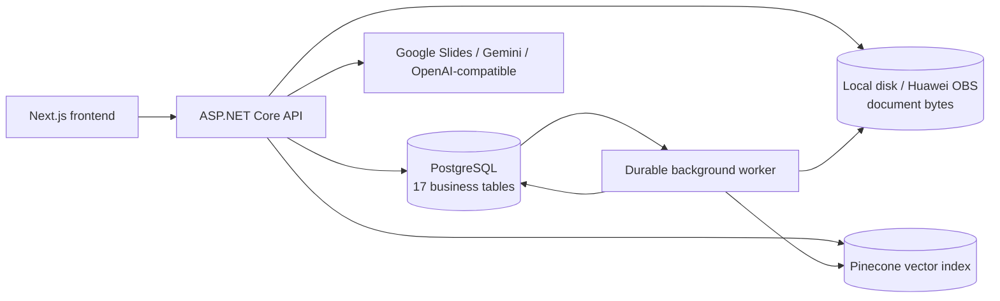
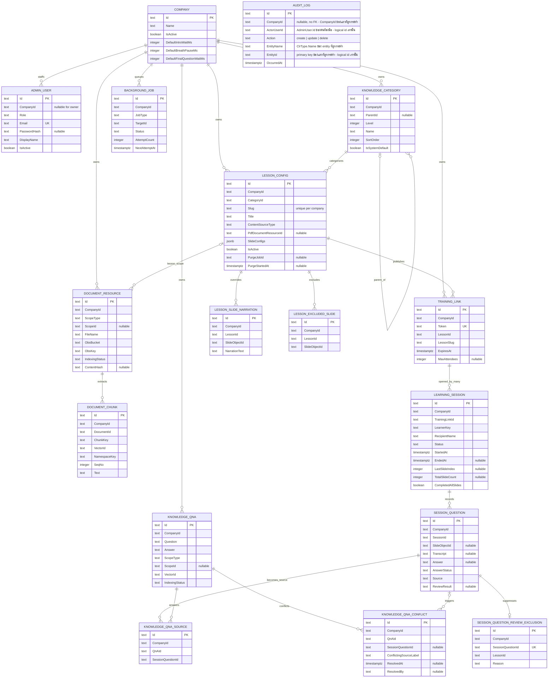
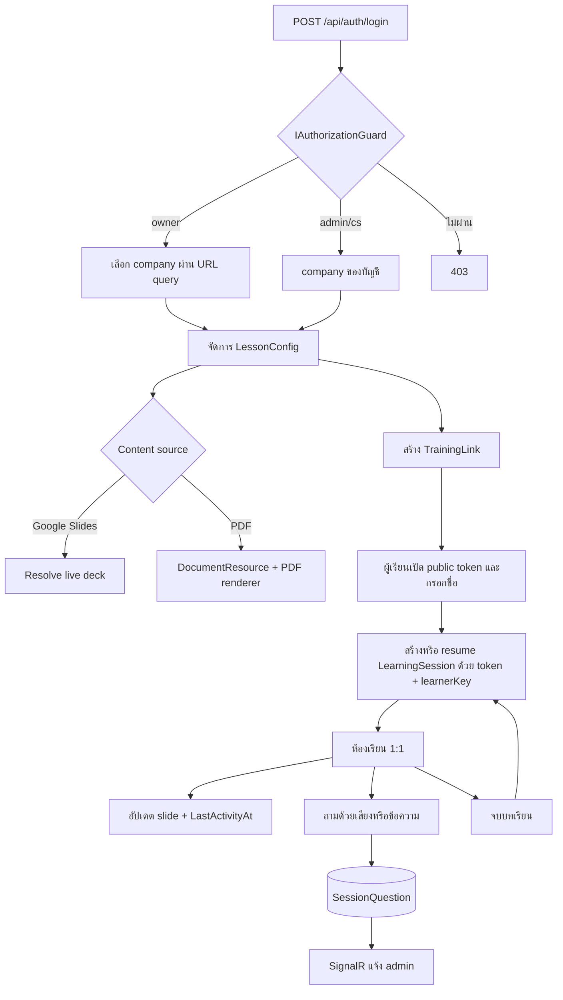
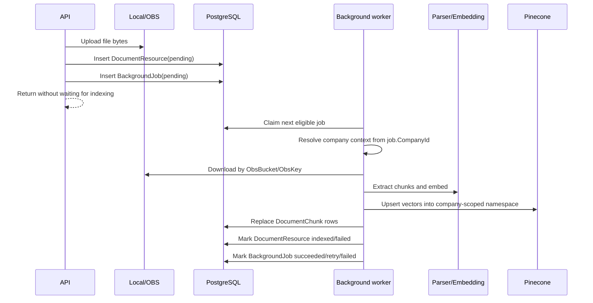
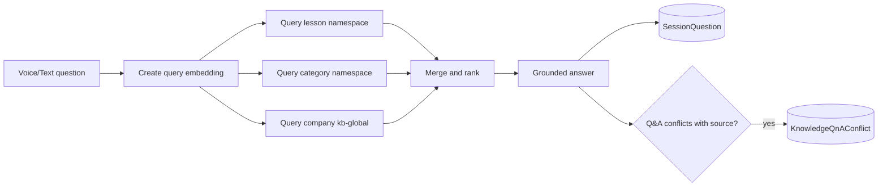
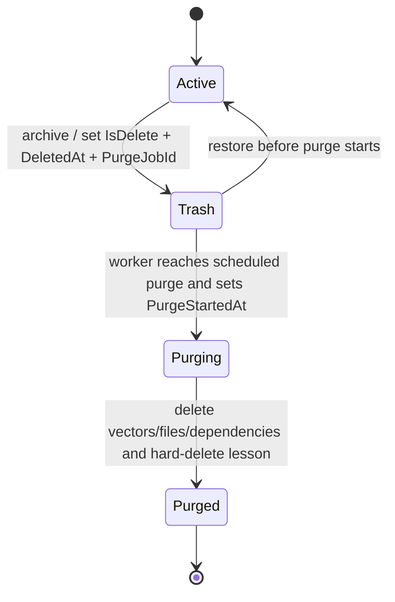

# SupportRoom Backend — ER Diagram and Workflow

> Source of truth: `ApplicationDbContext`, domain entities และ EF Core migrations ใน
> `backend/src/SupportRoom.Providers.Data/`
>
> รายการ columns และ indexes ครบทุกตารางอยู่ที่
> [`DATABASE_SCHEMA_SUMMARY.md`](./DATABASE_SCHEMA_SUMMARY.md) และ
> [`supportroom.dbml`](./supportroom.dbml) ส่วน SQL พร้อมใช้ดูที่
> [`supportroom-schema.sql`](./supportroom-schema.sql) และ
> [`supportroom-migrations-idempotent.sql`](./supportroom-migrations-idempotent.sql)

## Persistence Architecture



- PostgreSQL เป็นฐานข้อมูลธุรกิจหลัก 1 database ต่อ environment
- Pinecone เป็น vector database 1 index ต่อ environment แบ่ง tenant/scope ด้วย namespace
- Local disk หรือ Huawei OBS เก็บ file bytes; PostgreSQL เก็บ pointer ใน `DocumentResource`
- ไม่มี database แยกต่อบริษัท ทุกบริษัทอยู่ PostgreSQL เดียวกันและแยกด้วย `CompanyId`

## Current Table Inventory

| กลุ่ม | Tables |
|---|---|
| Tenant/auth | `Company`, `AdminUser` |
| Lesson/content | `KnowledgeCategory`, `LessonConfig`, `LessonSlideNarration`, `LessonExcludedSlide` |
| Documents/jobs | `DocumentResource`, `DocumentChunk`, `BackgroundJob` |
| Knowledge Q&A | `KnowledgeQnA`, `KnowledgeQnASource`, `KnowledgeQnAConflict` |
| Learning | `TrainingLink`, `LearningSession`, `SessionQuestion`, `SessionQuestionReviewExclusion` |
| Audit | `AuditLog` |

รวม 17 business tables ไม่รวม `__EFMigrationsHistory` ของ EF Core

## ER Diagram

แผนภาพนี้แสดง domain relationships ปัจจุบัน หลายความสัมพันธ์เป็น logical string IDs ที่ service
และ repository บังคับเอง ไม่ใช่ PostgreSQL foreign-key constraints



`AUDIT_LOG` ไม่มีเส้นความสัมพันธ์ในไดอะแกรมข้างบนโดยตั้งใจ - มันบันทึกการกระทำกับ**ทุก**ตารางใน
รายการนี้ (ยกเว้นตัวเอง) ผ่าน `ActorUserId`/`EntityName`/`EntityId` ที่เป็น logical string id ล้วน
ไม่ใช่ FK จริง (audit-trail module, DM-A1)

ทุก business table มี audit columns `Id`, `CreateBy`, `CreateDate`, `UpdateBy`, `UpdateDate`,
`DeleteBy`, `IsDelete`, `DeletedAt`; diagram ตัด audit columns ส่วนใหญ่ออกเพื่อให้อ่านได้

## Logical Relationships

ความสัมพันธ์สำคัญที่ไม่มี PostgreSQL FK constraint:

- `AdminUser.CompanyId` → `Company.Id`
- `KnowledgeCategory.ParentId` → `KnowledgeCategory.Id`
- `LessonConfig.CategoryId` → `KnowledgeCategory.Id`
- `LessonConfig.PdfDocumentResourceId` → `DocumentResource.Id`
- `LessonConfig.PurgeJobId` → `BackgroundJob.Id`
- `LessonSlideNarration.LessonId`, `LessonExcludedSlide.LessonId` → `LessonConfig.Id`
- `DocumentChunk.DocumentId` → `DocumentResource.Id`
- `TrainingLink.LessonId` → `LessonConfig.Id`
- `LearningSession.TrainingLinkId` → `TrainingLink.Id`
- `SessionQuestion.SessionId` → `LearningSession.Id`
- `KnowledgeQnASource.QnAId` → `KnowledgeQnA.Id`
- `KnowledgeQnASource.SessionQuestionId` → `SessionQuestion.Id`
- `KnowledgeQnAConflict.QnAId` → `KnowledgeQnA.Id`
- `SessionQuestionReviewExclusion.SessionQuestionId` → `SessionQuestion.Id`

Polymorphic fields:

- `DocumentResource.ScopeId` ชี้ lesson/category หรือ null สำหรับ company scope
- `KnowledgeQnA.ScopeId` ใช้รูปแบบเดียวกัน
- `BackgroundJob.TargetId` ชี้ document/lesson/Q&A ตาม `JobType`
- `SessionQuestionReviewExclusion.LessonId` อาจชี้ lesson ที่ hard-delete ไปแล้ว จึงห้ามสร้าง FK

## Data Isolation

`ApplicationDbContext` ใช้ fail-closed company query filters:

- 13 tables มี `CompanyId == ICompanyContext.CompanyId` query filter
- `Company` ไม่มี filter เพราะเป็น tenant registry
- `AdminUser` ไม่มี filter เพราะ login ค้น email ก่อนรู้ company และ owner มี `CompanyId = null`
- `BackgroundJob` ไม่มี filter เพราะ worker ต้อง claim งานข้ามบริษัทก่อน resolve context จาก row
- `AuditLog` ไม่มี filter เพราะ `CompanyId` เป็น `null` ได้ (แถวระดับระบบ) และ filter จะทำให้แถว
  เหล่านั้นหายไปจากทุกคนตลอดกาล (audit-trail module, มติ OQ-2) - ต่างจากอีกสามตัวที่ไม่มี filter
  ด้วยเหตุผลเรื่อง bootstrap/worker, `AuditLog` เป็นตารางที่ไม่มี filter โดยเจตนาถาวร
- entities ที่ต้องหายจาก normal UI เพิ่มเงื่อนไข `!IsDelete` ใน filter ของตัวเอง

ดังนั้น query ของ `Company`, `AdminUser`, `BackgroundJob` และ `AuditLog` ต้อง scope/authorize
อย่างชัดเจนที่ repository หรือ service ทุกครั้ง

## Data Ownership

- `LessonConfig.SlideConfigs` เป็น EF owned collection เก็บในคอลัมน์ JSONB เดียว
- Google Slides/PDF teaching content ไม่ถูก snapshot ซ้ำลง `LessonConfig`
- PDF/knowledge file bytes อยู่ local disk หรือ Huawei OBS
- `DocumentResource` เก็บ metadata และ storage pointer
- `DocumentChunk` เก็บข้อความที่ index สำเร็จจริง พร้อม Pinecone vector id/namespace สำหรับดูและลบ
- Pinecone อยู่นอก PostgreSQL และแยก namespace เป็น `{CompanyId}:{scope}`
- ไม่มีตาราง session summary; summary คำนวณจาก `LearningSession` และ `SessionQuestion`
- 1 `TrainingLink` เปิดได้หลาย `LearningSession`; คนเดิมกดเรียนใหม่จะได้ session row ใหม่
- สถานะ “หยุดกลางคัน” คำนวณจาก `LastActivityAt` ไม่ได้เก็บเป็นคอลัมน์

## Admin and Learning Workflow



ฝั่งผู้เรียนไม่มี account และไม่ใช้ admin JWT แต่ protected ด้วยคู่ credential
`TrainingLink.Token + LearnerKey`; token อย่างเดียวต้องไม่สามารถอ่าน session ของผู้เรียนคนอื่นได้

## Durable Document Indexing Workflow



งานไม่อยู่ใน in-memory queue แล้ว `BackgroundJob` ทำให้ retry และ recovery หลัง process restart ได้

## Knowledge and RAG Workflow

Pinecone record shape:

- common: `id`, embedding `values`, `namespace`, metadata `__text`
- slide metadata: `slideObjectId`, `index`, `sourceType=slide`
- document metadata: `documentId`, `chunkId`, `fileName`, `sourceType=document`
- Q&A metadata: `qnaId`, `sourceType=qna`

Namespace keys:

- lesson: `{companyId}:{lessonSlug}`
- category: `{companyId}:{categoryId}`
- company-wide: `{companyId}:kb-global`



## Lesson Trash and Purge Workflow



- purge job ถูกกำหนดไว้ 60 วันหลัง archive
- เมื่อ `PurgeStartedAt` ถูกตั้งแล้ว restore ต้องถูกปฏิเสธ
- purge สร้าง `SessionQuestionReviewExclusion` ก่อนลบ Q&A sources เพื่อไม่ให้คำถามเก่ากลับเข้า queue
- `SessionQuestion` และประวัติการเรียนยังคงอยู่แม้ lesson ถูกลบถาวร
- **`Active → Trash` และ `Trash → Active` เขียนแถว `AuditLog` ด้วยมือในธุรกรรมเดียวกัน** (audit-trail
  module, RS-1/RS-2/RS-3/RS-4) เพราะทั้งสองใช้ `ExecuteUpdate`/`ExecuteSqlRaw` ซึ่งไม่ผ่าน EF change
  tracker — interceptor ปกติของ `SaveChanges` มองไม่เห็น: archive เขียน 1 แถว `delete`/`LessonConfig`
  บวก 1 แถวต่อ `TrainingLink` ที่ถูกปิดจริง (cascade), restore เขียน 1 แถว `update`/`LessonConfig`
  (บวกอีก 1 แถว `update`/`BackgroundJob` ถ้ายกเลิก purge job พร้อมกัน) — ดู
  `_docs/module/audit-trail/design.md` §RS-0..RS-8 สำหรับสัญญาเต็ม
- **การเร่งลบถาวร (`AccelerateLessonPurge`, admin สั่งลบทันทีไม่ต้องรอ 60 วัน) เขียน 1 แถว
  `update`/`BackgroundJob` ด้วยเหตุผลเดียวกัน** (RS-5) — purge ที่ worker ทำเองตามกำหนดเวลาปกติ
  (`TryClaimPurge`/`ClaimNext`) **ไม่เขียน log** เพราะไม่มีคนลงมือ (มติ OQ-3 ของ audit-trail module)

### Role matrix (LT-2)

| Action | `owner` | `admin` | `cs` |
|---|---|---|---|
| `GET /api/lessons/trash` (view trash list) | ✅ | ✅ | ❌ 403 |
| `POST /api/lessons/{id}/trash` (archive) | ✅ | ✅ | ❌ 403 |
| `POST /api/lessons/{id}/restore` | ✅ | ✅ | ❌ 403 |
| `POST /api/lessons/{id}/permanent-delete` (typed confirmation) | ✅ | ❌ 403 | ❌ 403 |

`owner` ต้องเลือก company context ก่อน (ผ่าน `EnsureCanAccessCompany`) เหมือน `admin` ทุกเส้นทาง —
สิทธิ์ระดับ role เป็นชั้นถัดไปบน server เท่านั้น ไม่ใช่แทนที่ company scoping

### `lesson_purge` retry semantics (LT-14)

- เหมือน `document_index`/`vector_delete` เฉพาะ 3 ครั้งแรก: backoff ที่ 1 นาที / 5 นาที / 15 นาที
- **หลังความพยายามครั้งที่ 3 ล้มเหลว `lesson_purge` จะไม่กลายเป็น `failed` ถาวรเหมือน job type อื่น**
  — job กลับไปที่ `pending` และ retry ทุก 24 ชั่วโมงไม่มีกำหนด จนกว่าจะสำเร็จหรือ lesson ถูก restore
  (ซึ่งยกเลิก job ทันทีในธุรกรรมเดียวกับการ restore)
- ไม่มีอีเมล/notification ใด ๆ ระหว่างรอ retry — `AttemptCount`/`LastErrorCode`/`LastErrorDetail`
  เป็นร่องรอยเดียวที่มองเห็นได้ (ผ่าน DB โดยตรง)
- ถ้ายังมี `LearningSession` สถานะ `IN_PROGRESS` ใต้ lesson นั้นตอนถึงกำหนด worker จะเลื่อนออกไป 1
  ชั่วโมงโดยไม่นับเป็นความพยายามที่ล้มเหลว (ไม่กระทบ `AttemptCount`)

### Migration preflight (LT-24)

ก่อน apply `AddLessonTrashLifecycle` กับ environment ใด ต้องรัน
[`preflight-lt24-lesson-trash.sql`](../scripts/preflight-lt24-lesson-trash.sql) กับ PostgreSQL
เป้าหมายโดยไม่มีการเขียนข้อมูลใด ๆ: ผลที่ถูกต้องต้องเป็น **0 rows** ของ
`LessonConfig.IsDelete = true`. หากพบแม้หนึ่งแถว ให้หยุด apply และตรวจรายแถว; ห้ามเดาว่าเป็น
trash เดิมหรือสร้าง `lesson_purge` ย้อนหลัง. เก็บผลลัพธ์ของ environment นั้นไว้ใน deploy record
ก่อน migration จริงเสมอ.

## Schema Changes

สร้าง migration ใหม่เสมอ ห้ามแก้ migration ที่ deploy แล้ว:

```powershell
dotnet ef migrations add <Name> --project src/SupportRoom.Providers.Data --startup-project src/SupportRoom.Api
dotnet ef database update --project src/SupportRoom.Providers.Data --startup-project src/SupportRoom.Api
```

หลังเปลี่ยน schema ต้องตรวจ generated migration และอัปเดต artifacts ให้ตรงกัน:

1. `DATABASE_SCHEMA_SUMMARY.md`
2. `supportroom.dbml`
3. `ER_DIAGRAM_AND_WORKFLOW.md`
4. regenerate `supportroom-schema.sql`
5. regenerate `supportroom-migrations-idempotent.sql`
