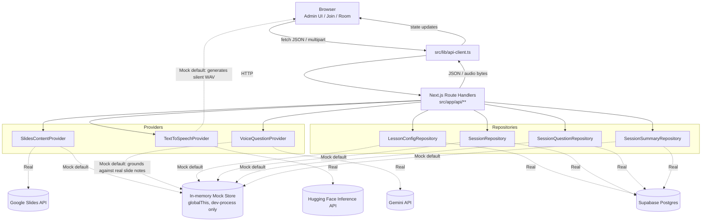

# Data Flow Diagram

## หลักการ

- ลูกศร **Real** (เส้นประ) คือ Path ที่ทำงานเมื่อสลับ Environment Variable ไปใช้ Provider
  จริง (`SLIDES_PROVIDER=google`, `TTS_PROVIDER=huggingface`,
  `VOICE_QUESTION_PROVIDER=gemini`, `DATA_PROVIDER=supabase`) — Route Handler และ UI
  ไม่ต้องแก้เลยเมื่อสลับ เพราะ Factory (`src/providers/*/index.ts`) เป็นจุดเดียวที่
  ตัดสินใจ
- **Browser ไม่เคยคุยกับ Google/Gemini/Hugging Face/Supabase โดยตรง** — ทุกอย่างผ่าน
  Route Handler เสมอ (Secret จึงไม่มีทางหลุดไปที่ Client Bundle)
- **Mock Store เป็น In-memory** อยู่ในโปรเซส Next.js dev server เท่านั้น — ไม่ persist
  ข้าม Restart และไม่แชร์กับ Serverless Instance อื่นถ้า Deploy แบบ Production
  Serverless (ดู [BACKEND_HANDOFF.md](./BACKEND_HANDOFF.md) หัวข้อ Known Risks)
