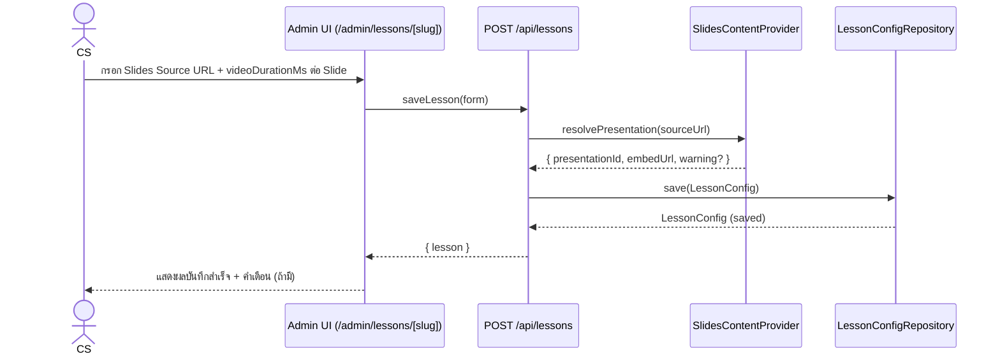
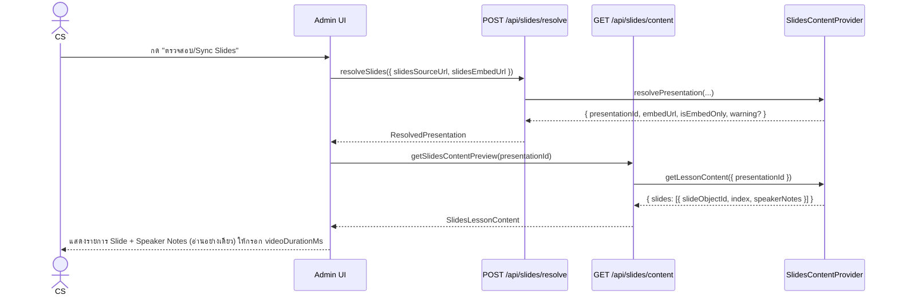
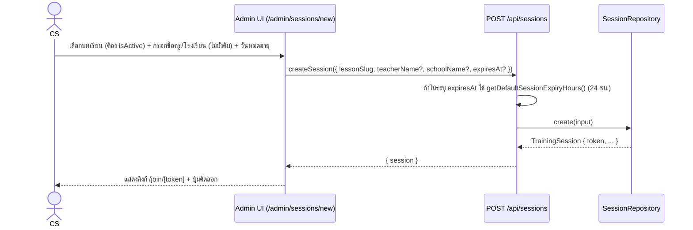
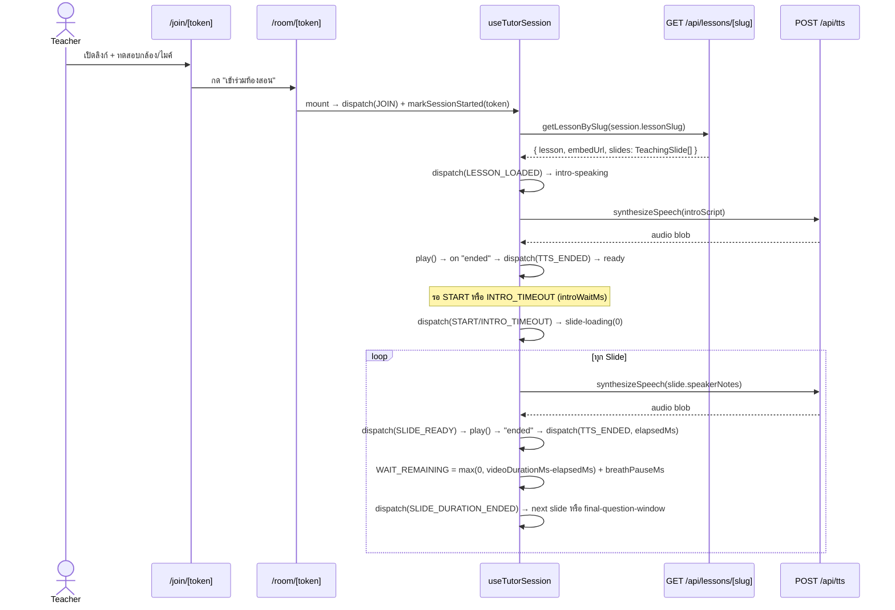
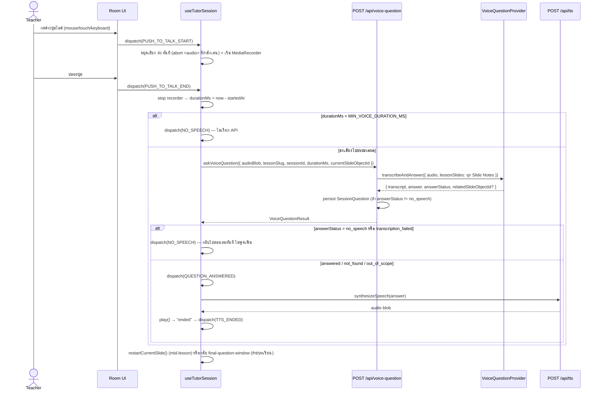
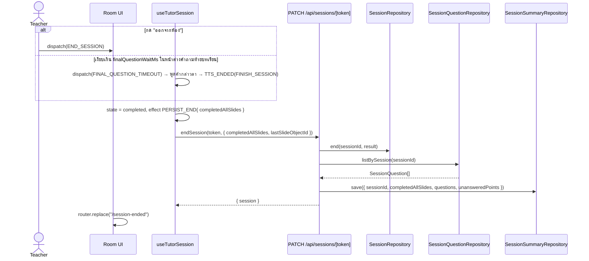

# Sequence Diagrams

ตรงกับ Route Handler และ Hook จริงในโค้ด (`src/app/api/**`, `src/hooks/use-tutor-session.ts`)

## 1. CS บันทึก Google Slides Lesson Config

## 2. Sync Google Slides และ Speaker Notes

## 3. CS สร้าง Session Link

## 4. คุณครูเข้าห้องและเริ่มสอน

## 5. Push-to-Talk → Gemini/Mock → Hugging Face/Mock → Resume/Restart Slide

## 6. จบ Session และบันทึก Summary

