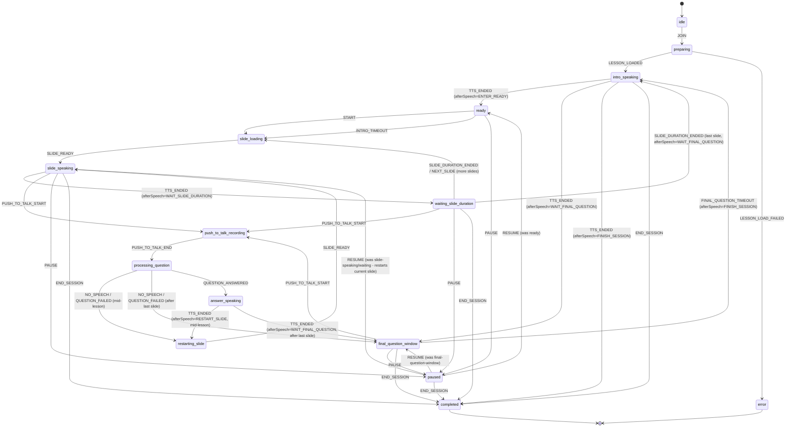

# Tutor Engine State Machine

> ตรงกับ `src/tutor/types.ts`, `src/tutor/intents.ts`, `src/tutor/tutor-reducer.ts` จริง
> ทดสอบพฤติกรรมหลักไว้ใน `src/tutor/tutor-reducer.test.ts`

## States (14)

`idle · preparing · intro-speaking · ready · slide-loading · slide-speaking ·
waiting-slide-duration · push-to-talk-recording · processing-question ·
answer-speaking · restarting-slide · paused · final-question-window · completed · error`

หมายเหตุการออกแบบ: `intro-speaking` ถูกใช้ซ้ำสำหรับทุกครั้งที่ AI พูด "ประกาศทั่วไป" ที่ไม่ใช่
เนื้อหา Slide หรือคำตอบ (คำทักทาย, คำถามท้ายบทเรียน, คำกล่าวลา) และ `answer-speaking`
ใช้เฉพาะตอนพูดคำตอบจาก Push-to-Talk เท่านั้น — แยกด้วยฟิลด์ `afterSpeech` ใน Runtime
(ไม่ใช่ State ใหม่) เพื่อไม่ให้ State เกิน 14 ตัวตามสเปก

## Events

**User-triggered** (`TutorUserEvent`): `JOIN · START · PUSH_TO_TALK_START ·
PUSH_TO_TALK_END · PAUSE · RESUME · END_SESSION · TOGGLE_MIC · TOGGLE_CAMERA`

**Engine-driven** (`TutorInternalEvent`, dispatch โดย `use-tutor-session.ts` เท่านั้น):
`LESSON_LOADED · LESSON_LOAD_FAILED · INTRO_TIMEOUT · SLIDE_READY · TTS_ENDED ·
SLIDE_DURATION_ENDED · NO_SPEECH · QUESTION_ANSWERED · QUESTION_FAILED ·
RESTART_CURRENT_SLIDE · NEXT_SLIDE · FINAL_QUESTION_TIMEOUT · FAIL`

## Diagram

## กติกาที่ Reducer บังคับใช้ (และมี Unit Test คุ้มครองไว้)

| กติกาจาก Prompt | Implementation |
|---|---|
| `slideDurationMs = max(ttsDuration, videoDuration)` แล้วบวก `breathPauseMs` | `TTS_ENDED` case `WAIT_SLIDE_DURATION`: `Math.max(0, videoDurationMs - elapsedMs) + breathPauseMs` |
| ไม่มี Checkpoint ถามว่า "เข้าใจไหม" ระหว่าง Slide | ไม่มี State/Event ชื่อ Checkpoint ในระบบใหม่นี้เลย |
| ไม่มี Progress Bar | Runtime ไม่มีฟิลด์ progress/percent ส่งออกไปให้ UI |
| No-speech/transcription-failed กลับไปสอนต่อ "โดยไม่พูดข้อความเพิ่มเติม" | `NO_SPEECH`/`QUESTION_FAILED` เรียก `resumeAfterInterruption()` ตรงไปที่ `restartCurrentSlide()` ไม่มี effect `SPEAK` คั่นกลาง |
| Slide ที่มีวิดีโอ Restart จากต้นหลังตอบคำถาม | `QUESTION_ANSWERED` ตั้ง `afterSpeech = RESTART_SLIDE` เสมอ (ไม่แยก mid-sentence resume) — ใช้ Restart-only Policy เดียวกันทั้งภาพนิ่งและวิดีโอเพื่อความสม่ำเสมอ ตามที่สเปกอนุญาตให้ทำได้เมื่อ Resume ระดับตำแหน่งเดิมซับซ้อนเกินไป |
| ห้ามข้าม Slide | ไม่มี Event สำหรับ Skip/Jump-to-slide ใน Public UI |
| ป้องกัน Double Submit ปุ่ม Push-to-Talk | `PUSH_TO_TALK_START` valid เฉพาะจาก `slide-speaking`/`waiting-slide-duration`/`final-question-window`; กดซ้ำตอน `push-to-talk-recording`/`processing-question` จะถูก reducer เพิกเฉย (`noEffect`) |

## Effect ที่ Reducer คืนให้ Hook ทำงานจริง

`src/tutor/types.ts` → `TutorEffect`: `LOAD_LESSON · SPEAK{text} · WAIT_READY_TIMEOUT{ms} ·
LOAD_SLIDE{slideIndex} · WAIT_REMAINING{ms} · START_RECORDING · STOP_RECORDING_AND_SEND ·
WAIT_FINAL_QUESTION{ms} · PERSIST_END{completedAllSlides}`

Effect ถูกตีความและรันจริงใน `src/hooks/use-tutor-session.ts` (เรียก TTS ผ่าน
`/api/tts`, โหลดบทเรียนผ่าน `/api/lessons/[slug]`, บันทึกจบ Session ผ่าน
`PATCH /api/sessions/[token]`) — Reducer เองไม่รู้จัก `fetch`, `MediaRecorder` หรือ
`<audio>` เลย ทำให้ทดสอบ Logic ได้โดยไม่ต้อง Mock Browser API (ดู
`tutor-reducer.test.ts`)
