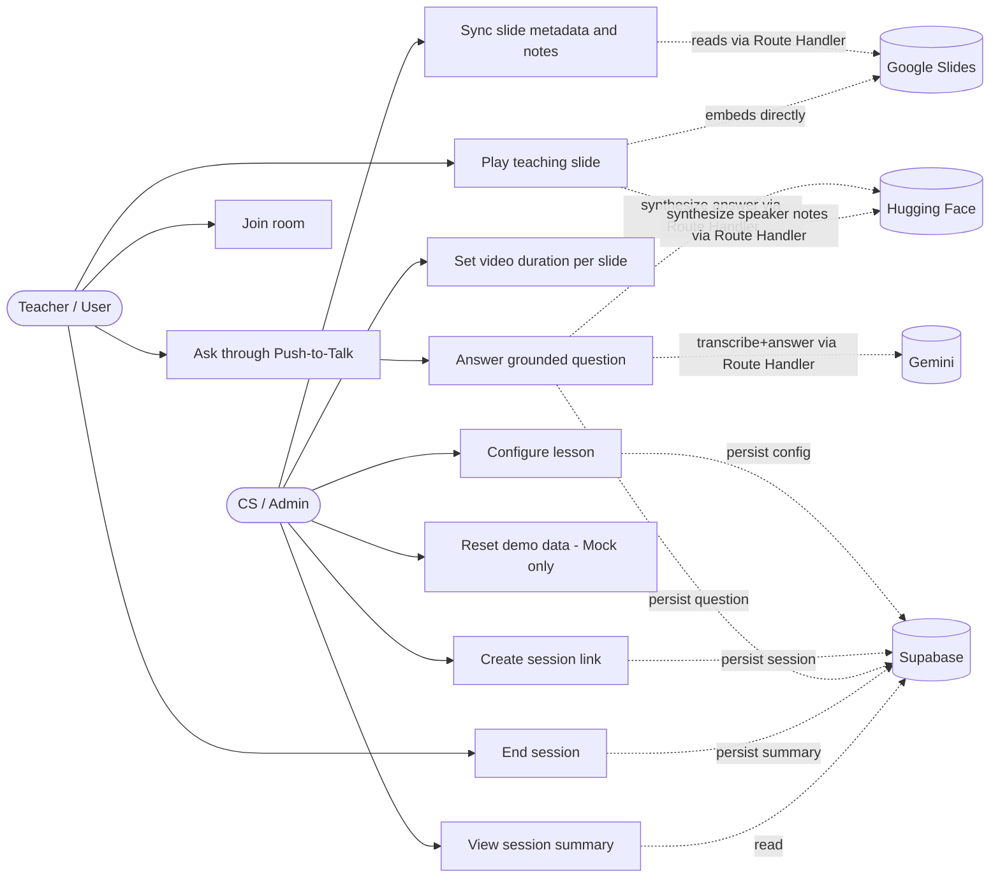

# Use Case Diagram

## รายละเอียด Use Case

| Use Case | Actor | Route Handler ที่เกี่ยวข้อง | สถานะ |
|---|---|---|---|
| Configure lesson | CS | `POST /api/lessons` | ทำงานจริงกับ Mock/Supabase Repository |
| Sync slide metadata and notes | CS | `POST /api/slides/resolve`, `GET /api/slides/content` | ทำงานจริงกับ Mock Provider, Google Provider Prepared |
| Set video duration per slide | CS | ส่วนหนึ่งของ `POST /api/lessons` (`slideConfigs[].videoDurationMs`) | ทำงานจริง |
| Create session link | CS | `POST /api/sessions` | ทำงานจริง |
| Join room | Teacher | `GET /api/sessions/[token]` | ทำงานจริง |
| Play teaching slide | Teacher (ระบบขับเคลื่อนอัตโนมัติ) | `GET /api/lessons/[slug]`, `POST /api/tts` | ทำงานจริงกับ Mock, Real Provider Prepared |
| Ask through Push-to-Talk | Teacher | `POST /api/voice-question` | ทำงานจริงกับ Mock, Gemini Prepared |
| Answer grounded question | ระบบ (Gemini/Mock) | ส่วนหนึ่งของ `POST /api/voice-question` | Mock กราวด์กับ Speaker Notes จริง, Gemini Prepared |
| End session | Teacher | `PATCH /api/sessions/[token]` (action `end`) | ทำงานจริง |
| View session summary | CS | `GET /api/sessions/[token]/summary` | ทำงานจริง |
| Reset demo data | CS | `POST /api/admin/reset` | ทำงานเฉพาะ Mock Mode |
