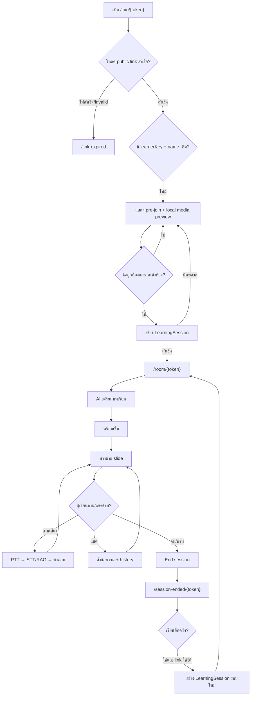
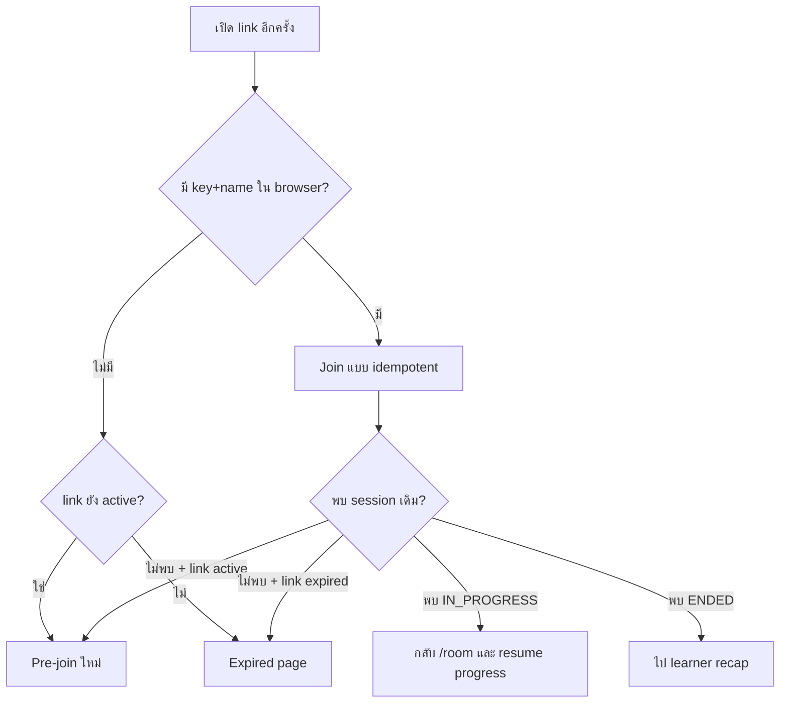
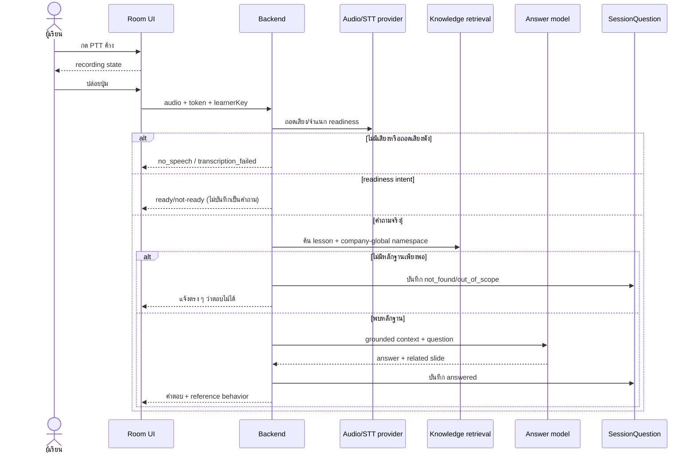
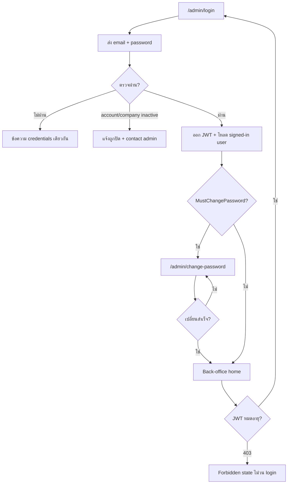
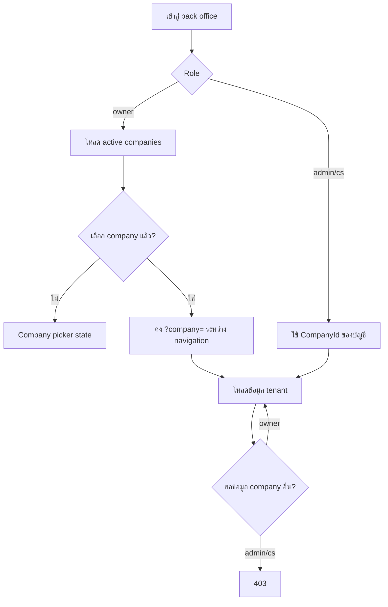
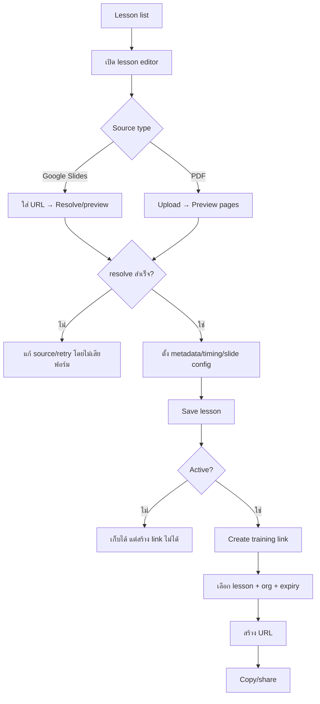
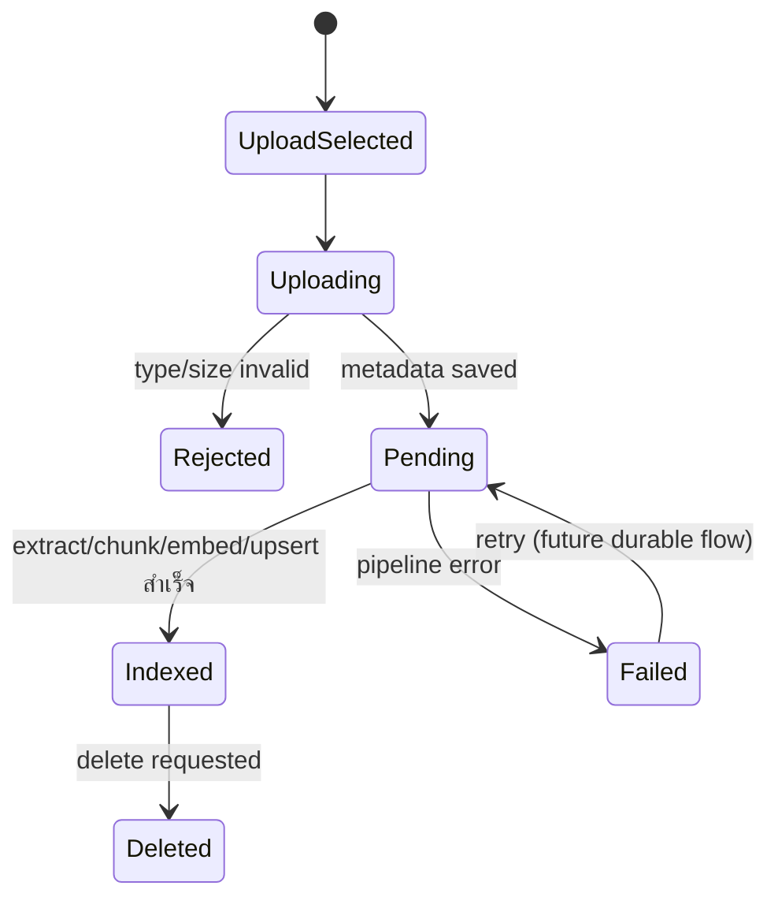
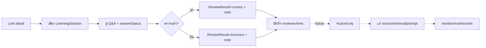
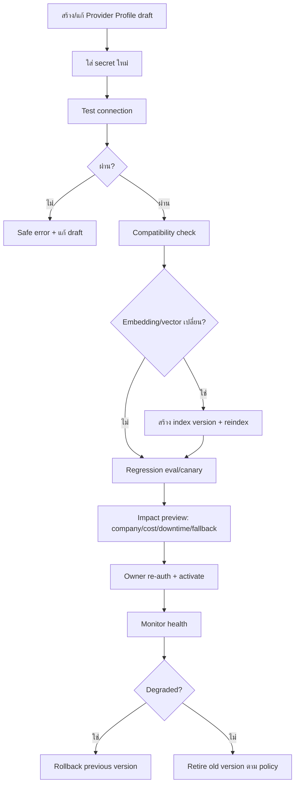
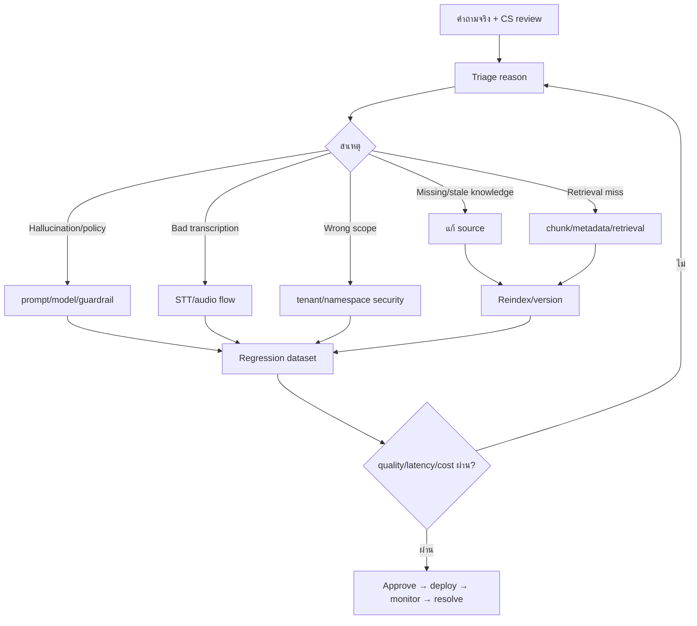

# SupportRoom AI — UX/UI Workflows

> Companion ของ [`UX_UI_WIREFRAME_SPEC.md`](./UX_UI_WIREFRAME_SPEC.md)  
> อธิบาย transition ระหว่างหน้าจอ ระบบ และบทบาท โดยแยก current flow ออกจาก future concept

## WF01 — ผู้เรียนใหม่เข้าห้องและเรียนจนจบ (`AS-IS`)

### UX checkpoints

- Pre-join: permission ถูกปฏิเสธแล้วต้องมี recovery instructions
- Room: state AI ต้องเห็น/ได้ยินชัด; processing หลายวินาทีต้องไม่ดูเหมือนค้าง
- Question: no speech/transcription fail/not found/out of scope ต้องใช้ข้อความคนละแบบ
- End: จบก่อนครบต้อง confirm; recap เห็นเฉพาะ session ของ browser ตน

## WF02 — ผู้เรียนกลับมาเรียนต่อและ link หมดอายุ (`AS-IS`)

**กติกา:** link expiry ป้องกันการเริ่มใหม่ แต่ไม่ไล่ผู้เรียนที่เริ่มทันเวลาออกกลางคัน

## WF03 — Voice question และ grounded answer (`AS-IS`)

**ห้าม UX เปลี่ยน:** ผู้เรียนไม่เห็นว่าส่งข้อใดให้ CS ตรวจ; readiness question ไม่ปรากฏใน review queue

## WF04 — Login, first password change และ authorization (`AS-IS`)

**ปัจจุบันไม่มี:** refresh token, server-side revoke/logout session, forgot/reset email, invite, SSO, MFA

## WF05 — Company context และ permission (`AS-IS`)

### Role actions

| Action | Owner | Admin | CS |
|---|:---:|:---:|:---:|
| ลิงก์/บทเรียน/เอกสาร/review | ✓ ทุกบริษัท | ✓ บริษัทตน | ✓ บริษัทตน |
| จัดการผู้ใช้ | ✓ | ✓ บริษัทตน | — |
| สร้าง/กำหนด owner | ✓ | — | — |
| Company management | ✓ | — | — |
| Provider/system config | future owner only | — | — |

## WF06 — สร้าง/แก้บทเรียน แล้วสร้างลิงก์ (`AS-IS`)

**Critical error UX:** source sync, PDF upload, save และ link creation เป็นคนละ operation ต้องบอกว่าอะไรล้มและ retry เฉพาะชั้นได้

## WF07 — Document ingestion (`AS-IS` พร้อม production gap)

**ข้อเท็จจริงปัจจุบัน:** background queue ยังไม่ durable และ retry/delete-vector consistency ยังเป็น production gap UI ต้องไม่แสดง automation ที่ backend ยังไม่มี

## WF08 — CS ตรวจคำตอบ AI (`AS-IS` → future feedback loop)

เส้นทึบคือสิ่งที่มีแล้ว เส้นประคือ Knowledge operations ที่ยังต้องออกแบบและพัฒนา

## WF09 — Provider/API key activation (`FUTURE CONCEPT`)

**Decision gates ก่อน final design:** global vs per-company/BYOK, KMS/Vault, deployment/data region, config version per answer, retention และ approval policy

## WF10 — Knowledge improvement loop (`FUTURE CONCEPT`)

## Cross-flow error routing

| Event | UX response | ห้ามทำ |
|---|---|---|
| Public token invalid/unknown | S04 generic message | บอกว่า token เคยมีหรือเผย tenant |
| Link expired, new learner | S04 | สร้าง session ใหม่ |
| Link expired, existing in-progress learner | resume room | ไล่ออกจากบทเรียนกลางคัน |
| Admin JWT expired | เก็บ intended URL แล้ว sign in ใหม่ | แสดง 403 |
| Admin forbidden | 403 + back to allowed scope | วนไป login |
| Provider/TTS unavailable | degraded/retry ตาม capability | จบ learner session อัตโนมัติ |
| Network reconnect | แสดง stale/reconnecting และ idempotent retry | สร้าง session/message ซ้ำ |
| Save failed | เก็บ input + retry | ล้างฟอร์ม |

## Workflow acceptance checklist

- ทุก transition มี trigger, loading, success, error และ safe destination
- back/refresh/deep link ทำงานโดยไม่ข้าม permission หรือสร้างข้อมูลซ้ำ
- owner company context ไม่หายระหว่างหน้า
- returning learner กลับ session เดิม; restart เท่านั้นที่สร้างรอบใหม่
- realtime disconnect แยกจาก fatal error
- future workflow มีป้ายชัดและไม่ผสมใน prototype ของ release ปัจจุบัน

