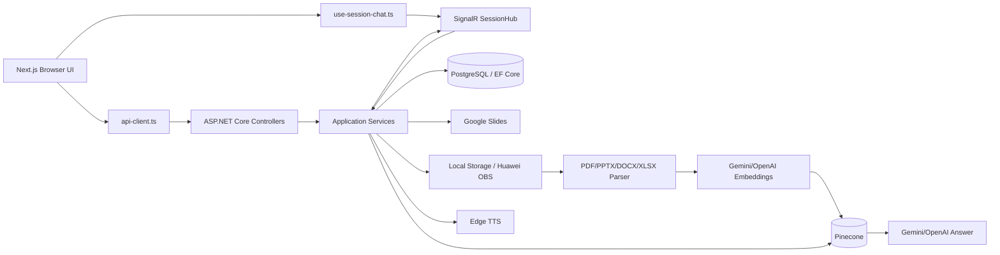

# Data Flow Diagram

## หลักการ

- Browser ส่ง REST/SignalR ไป .NET backend เท่านั้น
- Google Slides/PDF เป็น source of truth ของ teaching content
- PostgreSQL เก็บ config และ history; Pinecone เก็บ retrieval vectors
- Voice RAG ทำ transcription → embedding/query → grounded answer
- Document upload ตอบกลับหลัง storage/DB commit แล้ว index ต่อใน background
- Credentials ไม่ผ่าน frontend
