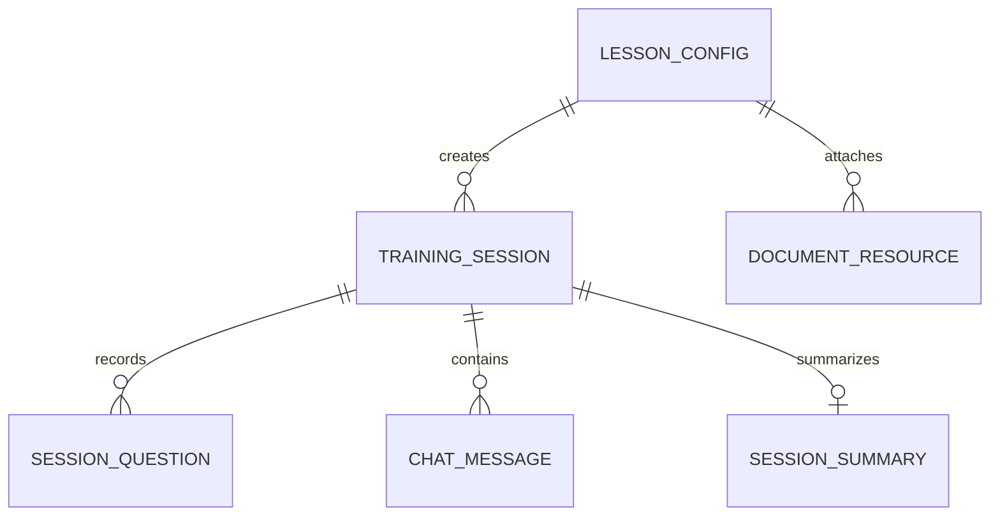

# ER Diagram

เอกสาร canonical ของ schema ปัจจุบันอยู่ที่
[`backend/docs/ER_DIAGRAM_AND_WORKFLOW.md`](../../backend/docs/ER_DIAGRAM_AND_WORKFLOW.md)
และ EF Core migrations ใน `backend/src/SupportRoom.Providers.Data/Migrations/`

ตารางหลักปัจจุบันมี 6 กลุ่ม:

- `LessonConfig` — metadata และ timing; `SlideConfigs` เป็น owned JSON collection
- `TrainingSession` — public token, status, expiry และผลการเรียน
- `SessionQuestion` — transcript/answer/status จาก Push-to-Talk
- `ChatMessage` — typed chat history
- `SessionSummary` — completion และ unanswered points
- `DocumentResource` — metadata/storage pointer/indexing status

Database เป็น PostgreSQL ผ่าน EF Core/Npgsql ไม่ใช่ Supabase และ schema เปลี่ยนผ่าน migration ใหม่
