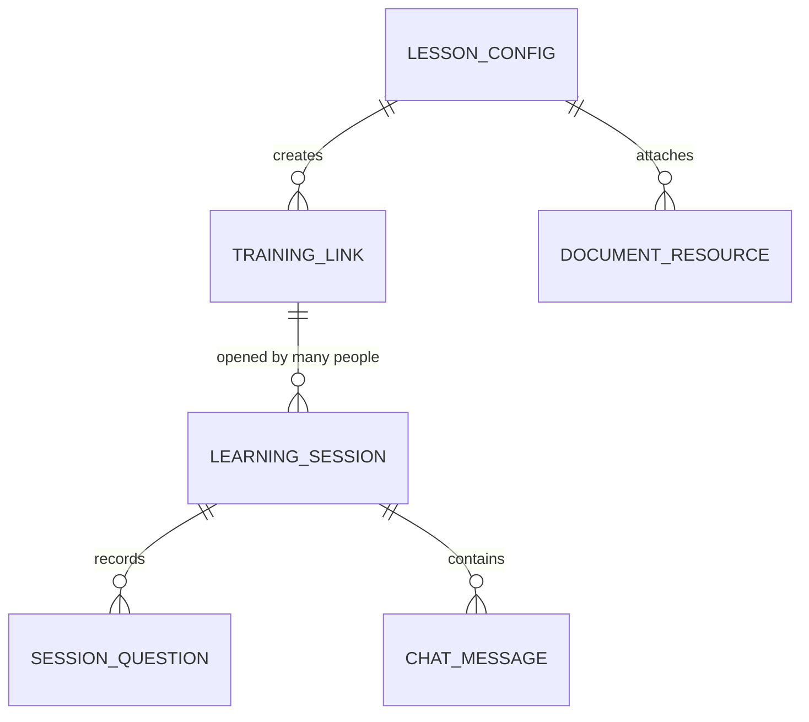

# ER Diagram

เอกสาร canonical ของ schema ปัจจุบันอยู่ที่
[`backend/docs/ER_DIAGRAM_AND_WORKFLOW.md`](../../backend/docs/ER_DIAGRAM_AND_WORKFLOW.md)
และ EF Core migrations ใน `backend/src/SupportRoom.Providers.Data/Migrations/`

ตารางหลักปัจจุบันมี 6 กลุ่ม:

- `LessonConfig` — metadata และ timing; `SlideConfigs` เป็น owned JSON collection
- `TrainingLink` — ลิงก์ที่ CS สร้าง: public token, expiry, หน่วยงานผู้รับ
  **1 ลิงก์เปิดได้หลายคน** สถานะ ACTIVE/EXPIRED คำนวณจาก `ExpiresAt` ไม่ได้เก็บ
- `LearningSession` — การเรียนของคนหนึ่งคน แยกคนด้วย `LearnerKey` ที่ browser เก็บ
- `SessionQuestion` — transcript/answer/status จาก Push-to-Talk + ผลรีวิวของ CS
- `ChatMessage` — typed chat history
- `DocumentResource` — metadata/storage pointer/indexing status

`SessionQuestion.SessionId` และ `ChatMessage.SessionId` ชี้ที่ `LearningSession` ไม่ใช่ที่ลิงก์ —
คำถามและแชตเป็นของคนที่ถาม ไม่ใช่ของลิงก์ที่เขาเดินเข้ามา

~~`SessionSummary`~~ ถูกลบทิ้ง (TD-013) — สรุปคำนวณสดตอนอ่าน

Database เป็น PostgreSQL ผ่าน EF Core/Npgsql ไม่ใช่ Supabase และ schema เปลี่ยนผ่าน migration ใหม่
