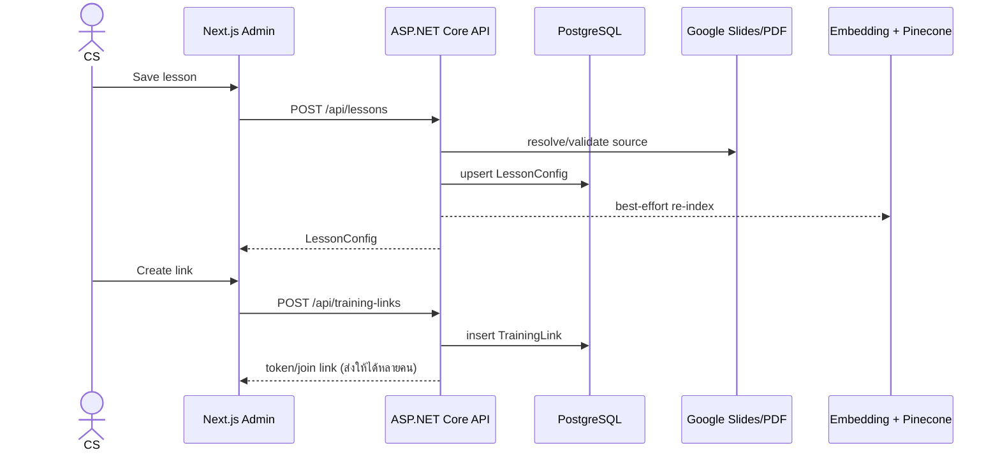
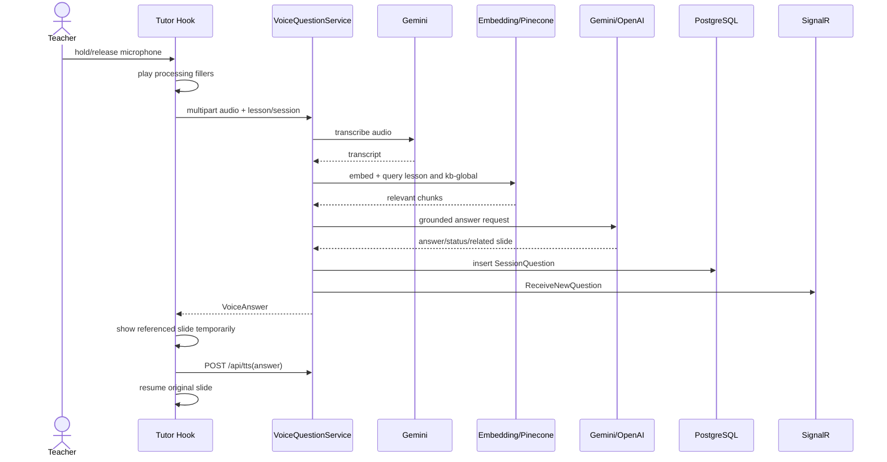
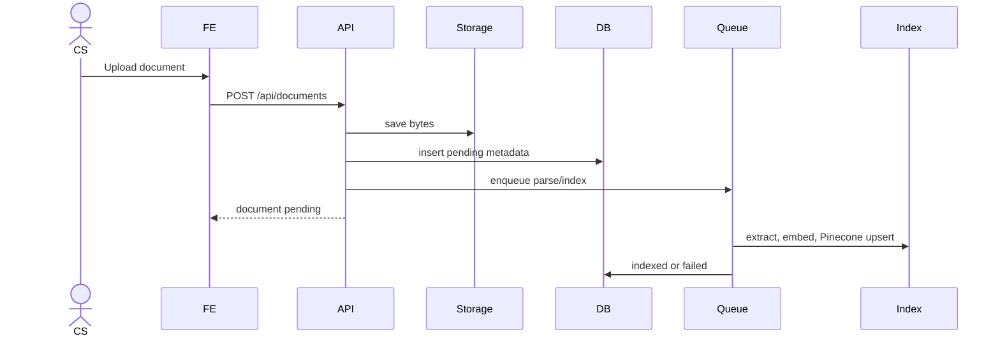
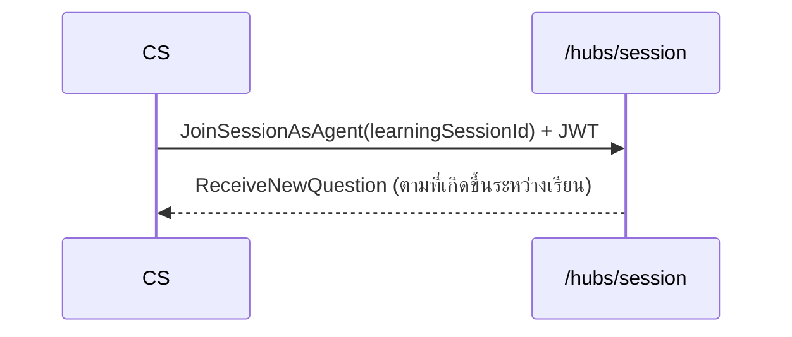

# Sequence Diagrams

## Lesson and Session Setup



## Join and Teaching

หลายคนเดินผ่าน diagram นี้พร้อมกันบนลิงก์เดียวกัน แต่ละคนได้ `LearningSession` ของตัวเอง

```mermaid
sequenceDiagram
    actor Learner as ผู้เรียน
    participant FE as Join + Room + Tutor Hook
    participant API as ASP.NET Core API
    participant TTS as Edge TTS

    Learner->>FE: Open token
    FE->>API: GET /api/training-links/{token}
    FE->>FE: อ่าน/สร้าง learnerKey ใน localStorage
    Learner->>FE: กรอกชื่อ
    FE->>API: POST /api/learning-sessions/{token}/join
    Note over API: idempotent ต่อ learnerKey<br/>กลับมาใหม่ = ได้แถวเดิม + lastSlideIndex
    API-->>FE: LearningSession
    FE->>API: GET /api/lessons/{slug}
    API-->>FE: lesson + resolved slides
    FE->>API: POST /api/tts (intro)
    API->>TTS: synthesize
    TTS-->>FE: audio
    FE->>FE: readiness by button click only ("พร้อมแล้ว" or "ยังไม่พร้อม") - U1 (2026-08-23)
    Note over FE: ไม่มี auto-start timeout อีกต่อไปหลัง "ยังไม่พร้อม"; INTRO_TIMEOUT ยังมีผลถ้าไม่กด
    loop each slide
        FE->>API: POST /api/tts (speaker notes)
        API-->>FE: audio
        FE->>FE: play + wait remaining video/breath time
        FE-->>API: PATCH /api/learning-sessions/{token}/progress
        Note over API: อัปเดตแถวเดิม + LastActivityAt<br/>(ตัวเดียวที่ใช้คำนวณ "หยุดกลางคัน")
    end
    FE->>API: PATCH /api/learning-sessions/{token}/end
```

## Push-to-Talk RAG



Typed questions (`POST /api/text-question`, F10) follow the same diagram from `API->>Vector`
onward - the recipient's typed text stands in for the transcript, so there is no
`API->>Gemini: transcribe audio` step and no `durationMs`. Both paths write the same
`SessionQuestion` shape, differing only in `Source` (`"voice"` vs `"text"`).

## Document Upload



## SignalR — CS Live Questions

ฟีเจอร์แชตคุยกับ CS (ทั้งฝั่งผู้เรียนและฝั่ง CS) ถูกตัดออกทั้งฟีเจอร์ (F10-a, 2026-08-23, มติ
T4-a) — ผู้เรียนไม่มี client invoke ใดเหลือแล้วบน `/hubs/session` และไม่ต้อง join group ใดเพื่อให้
CS ได้ยิน (ดู "Push-to-Talk RAG" ด้านบนสำหรับ `ReceiveNewQuestion` broadcast)


