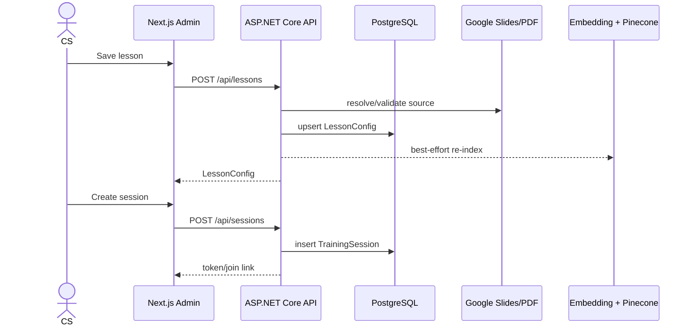
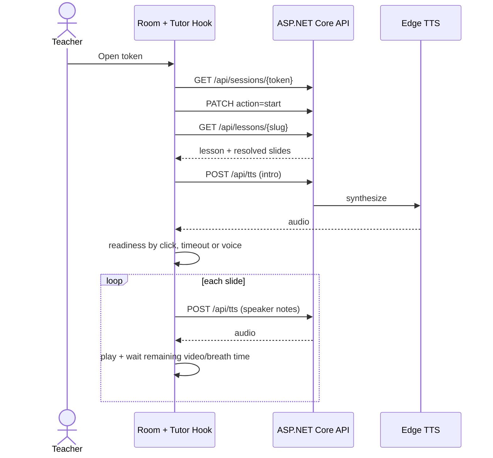
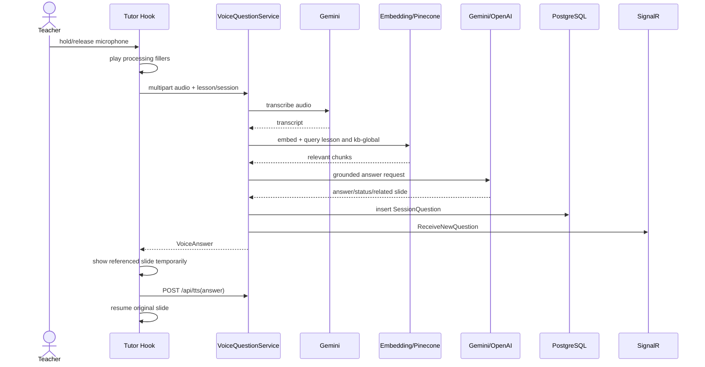
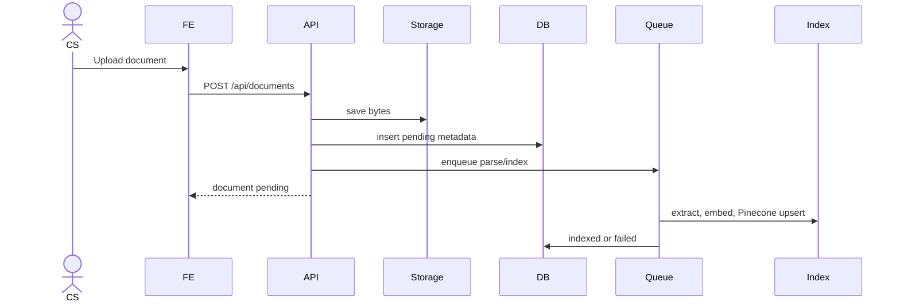
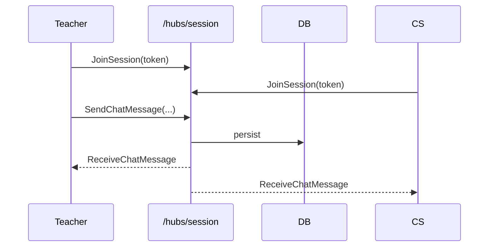

# Sequence Diagrams

## Lesson and Session Setup

```mermaid
sequenceDiagram
    actor CS
    participant FE as Next.js Admin
    participant API as ASP.NET Core API
    participant DB as PostgreSQL
    participant Content as Google Slides/PDF
    participant Index as Embedding + Pinecone

    CS->>FE: Save lesson
    FE->>API: POST /api/lessons
    API->>Content: resolve/validate source
    API->>DB: upsert LessonConfig
    API-->>Index: best-effort re-index
    API-->>FE: LessonConfig
    CS->>FE: Create session
    FE->>API: POST /api/sessions
    API->>DB: insert TrainingSession
    API-->>FE: token/join link
```

## Join and Teaching

```mermaid
sequenceDiagram
    actor Teacher
    participant FE as Room + Tutor Hook
    participant API as ASP.NET Core API
    participant TTS as Edge TTS

    Teacher->>FE: Open token
    FE->>API: GET /api/sessions/{token}
    FE->>API: PATCH action=start
    FE->>API: GET /api/lessons/{slug}
    API-->>FE: lesson + resolved slides
    FE->>API: POST /api/tts (intro)
    API->>TTS: synthesize
    TTS-->>FE: audio
    FE->>FE: readiness by click, timeout or voice
    loop each slide
        FE->>API: POST /api/tts (speaker notes)
        API-->>FE: audio
        FE->>FE: play + wait remaining video/breath time
    end
```

## Push-to-Talk RAG

```mermaid
sequenceDiagram
    actor Teacher
    participant FE as Tutor Hook
    participant API as VoiceQuestionService
    participant Gemini
    participant Vector as Embedding/Pinecone
    participant Answer as Gemini/OpenAI
    participant DB as PostgreSQL
    participant Hub as SignalR

    Teacher->>FE: hold/release microphone
    FE->>FE: play processing fillers
    FE->>API: multipart audio + lesson/session
    API->>Gemini: transcribe audio
    Gemini-->>API: transcript
    API->>Vector: embed + query lesson and kb-global
    Vector-->>API: relevant chunks
    API->>Answer: grounded answer request
    Answer-->>API: answer/status/related slide
    API->>DB: insert SessionQuestion
    API->>Hub: ReceiveNewQuestion
    API-->>FE: VoiceAnswer
    FE->>FE: show referenced slide temporarily
    FE->>API: POST /api/tts(answer)
    FE->>FE: resume original slide
```

## Document Upload

```mermaid
sequenceDiagram
    actor CS
    participant FE
    participant API
    participant Storage
    participant DB
    participant Queue
    participant Index

    CS->>FE: Upload document
    FE->>API: POST /api/documents
    API->>Storage: save bytes
    API->>DB: insert pending metadata
    API->>Queue: enqueue parse/index
    API-->>FE: document pending
    Queue->>Index: extract, embed, Pinecone upsert
    Queue->>DB: indexed or failed
```

## SignalR Chat

```mermaid
sequenceDiagram
    participant Teacher
    participant Hub as /hubs/session
    participant DB
    participant CS
    Teacher->>Hub: JoinSession(token)
    CS->>Hub: JoinSession(token)
    Teacher->>Hub: SendChatMessage(...)
    Hub->>DB: persist
    Hub-->>Teacher: ReceiveChatMessage
    Hub-->>CS: ReceiveChatMessage
```
