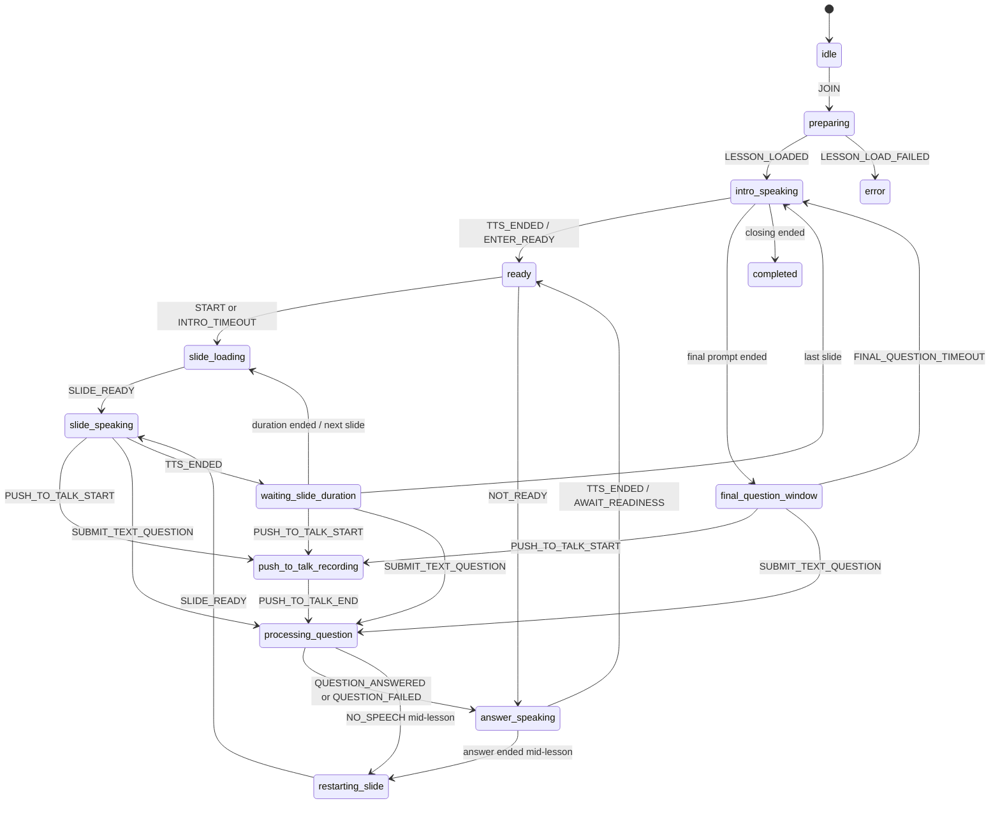

# Tutor Engine State Machine

Source of truth: `frontend/src/tutor/types.ts`, `intents.ts`, `tutor-reducer.ts` และ reducer tests

## States (15)

`idle`, `preparing`, `intro-speaking`, `ready`, `slide-loading`, `slide-speaking`,
`waiting-slide-duration`, `push-to-talk-recording`, `processing-question`, `answer-speaking`,
`restarting-slide`, `paused`, `final-question-window`, `completed`, `error`

## Main Flow

## Important Runtime Fields

- `currentSlideIndex` — ตำแหน่งบทเรียนจริง
- `answerSlideIndex` — slide override ชั่วคราวระหว่างอ่านคำตอบจาก slide อื่น
- `interruptedFrom` — state ก่อน Push-to-Talk เพื่อ resume ให้ถูกบริบท
- `afterSpeech` — action หลัง audio จบ เช่น restart, await readiness, finish
- `completedAllSlides` — ใช้ persist session result
- `micNotice` — recoverable microphone error ไม่เปลี่ยนทั้งห้องเป็น error state

## Rules

- `NO_SPEECH` กลับไปยัง slide/final window แบบเงียบ (ไม่มี "readiness" ให้กลับไปแล้ว - ดูด้านล่าง)
- `QUESTION_FAILED` พูดข้อความแจ้งก่อน resume
- **U1 (2026-08-23) - readiness ตอบได้ทางเดียวคือกดปุ่ม**: `START` (ปุ่ม "พร้อมแล้ว เริ่มเรียนเลย")
  เริ่ม slide แรกทันที ไม่มีเสียงตอบรับ · `NOT_READY` (ปุ่ม "ยังไม่พร้อม") พูด `notReadyScript`
  แล้วกลับสู่ `ready` โดยไม่มี auto-start timer · ทั้งพูดและพิมพ์ตอบ readiness ไม่ได้อีกต่อไป -
  event `READINESS_ANSWERED` และ effect ที่เกี่ยวข้องถูกลบทิ้งทั้งชุด (TQ-22..TQ-27)
- `SUBMIT_TEXT_QUESTION` (พิมพ์ถามในช่อง Ask AI) รับได้เฉพาะ `slide-speaking`,
  `waiting-slide-duration`, `final-question-window` - เหมือน `PUSH_TO_TALK_START` เป๊ะ ยกเว้นไม่ผ่าน
  `push-to-talk-recording` (ไม่มีอะไรให้อัด) และไม่หยุดบรรยายจนกว่าจะกดส่ง (พิมพ์ระหว่างบรรยายไม่ตัด
  ทันทีเหมือน Push-to-Talk - T5)
- Push-to-Talk **และ** SUBMIT_TEXT_QUESTION ใช้ได้จาก `slide-speaking`, `waiting-slide-duration`,
  `final-question-window` เท่านั้น - **ไม่ใช่จาก `ready` อีกต่อไป** (เดิมพูดตอบ "พร้อมแล้ว" ได้จากตรงนี้)
- คำตอบที่อ้าง slide อื่นจะแสดง slide นั้นชั่วคราว แต่ resume ที่ slide เดิม
- หลังคำตอบกลางบทเรียนจะ restart narration ของ slide เดิมพร้อม spoken bridge
- เวลา slide = `max(0, videoDurationMs - actualTtsMs) + breathPauseMs`
- Pause/resume เก็บ `pausedFrom`; mic permission failure ใช้ `MIC_UNAVAILABLE` และ resume ได้

## Effects

`NONE`, `LOAD_LESSON`, `SPEAK`, `WAIT_READY_TIMEOUT`, `LOAD_SLIDE`, `WAIT_REMAINING`,
`START_RECORDING`, `STOP_RECORDING_AND_SEND`, `SEND_TEXT_QUESTION`, `WAIT_FINAL_QUESTION`,
`PERSIST_END`

Hook เป็นผู้รัน effects, เล่น Edge TTS audio, ใช้ MediaRecorder, เรียก REST และตั้ง timer
