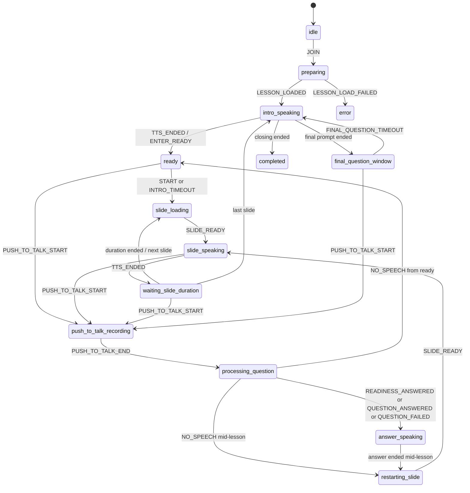

# Tutor Engine State Machine

Source of truth: `frontend/src/tutor/types.ts`, `intents.ts`, `tutor-reducer.ts` และ reducer tests

## States (15)

`idle`, `preparing`, `intro-speaking`, `ready`, `slide-loading`, `slide-speaking`,
`waiting-slide-duration`, `push-to-talk-recording`, `processing-question`, `answer-speaking`,
`restarting-slide`, `paused`, `final-question-window`, `completed`, `error`

## Main Flow

## Important Runtime Fields

- `currentSlideIndex` — ตำแหน่งบทเรียนจริง
- `answerSlideIndex` — slide override ชั่วคราวระหว่างอ่านคำตอบจาก slide อื่น
- `interruptedFrom` — state ก่อน Push-to-Talk เพื่อ resume ให้ถูกบริบท
- `afterSpeech` — action หลัง audio จบ เช่น start first slide, restart, await readiness, finish
- `completedAllSlides` — ใช้ persist session result
- `micNotice` — recoverable microphone error ไม่เปลี่ยนทั้งห้องเป็น error state

## Rules

- `NO_SPEECH` กลับไปยัง readiness/slide/final window แบบเงียบ
- `QUESTION_FAILED` พูดข้อความแจ้งก่อน resume
- ตอบ readiness ว่า ready จะพูดยืนยันแล้วเริ่ม slide แรก; not ready จะรอต่อโดยไม่มี auto-start timer
- คำตอบที่อ้าง slide อื่นจะแสดง slide นั้นชั่วคราว แต่ resume ที่ slide เดิม
- หลังคำตอบกลางบทเรียนจะ restart narration ของ slide เดิมพร้อม spoken bridge
- เวลา slide = `max(0, videoDurationMs - actualTtsMs) + breathPauseMs`
- Push-to-Talk ใช้ได้จาก `ready`, `slide-speaking`, `waiting-slide-duration`, `final-question-window`
- Pause/resume เก็บ `pausedFrom`; mic permission failure ใช้ `MIC_UNAVAILABLE` และ resume ได้

## Effects

`NONE`, `LOAD_LESSON`, `SPEAK`, `WAIT_READY_TIMEOUT`, `LOAD_SLIDE`, `WAIT_REMAINING`,
`START_RECORDING`, `STOP_RECORDING_AND_SEND`, `WAIT_FINAL_QUESTION`, `PERSIST_END`

Hook เป็นผู้รัน effects, เล่น Edge TTS audio, ใช้ MediaRecorder, เรียก REST และตั้ง timer
