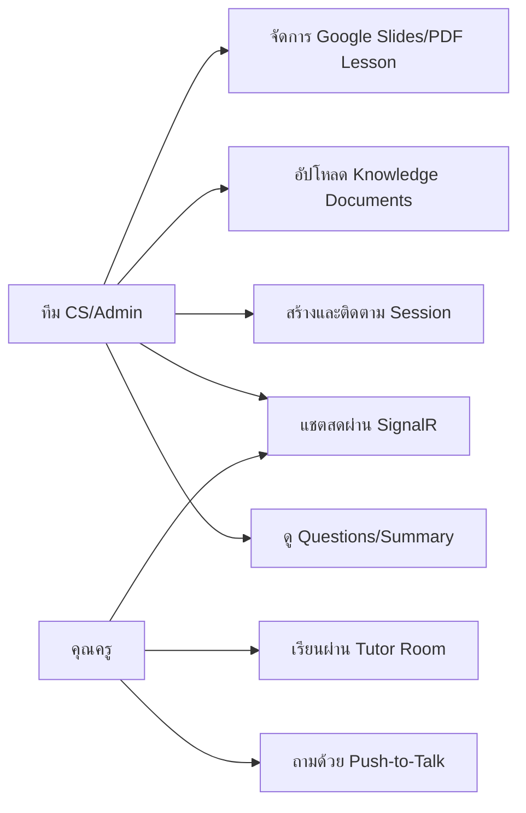

# Use Case Diagram

| Use case | Backend |
|---|---|
| จัดการบทเรียน | LessonController, Google Slides/PDF providers, PostgreSQL |
| สร้างลิงก์ | TrainingSessionController |
| สอนและเล่นเสียง | LessonController + TtsController |
| ถามเสียง | VoiceQuestionController + Gemini/RAG/Pinecone |
| Knowledge documents | DocumentsController + background queue |
| แชตสด | SessionHub + ChatMessageService |
| สรุปผล | SessionSummaryService |

ปัจจุบันทุก use case ไม่มี authentication; session token เป็นเพียง public identifier
