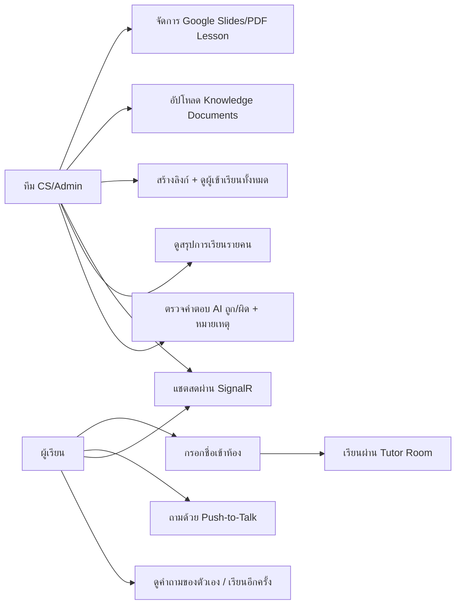

# Use Case Diagram

| Use case | Backend |
|---|---|
| จัดการบทเรียน | LessonController, Google Slides/PDF providers, PostgreSQL |
| สร้างลิงก์ | TrainingLinkController |
| เข้าห้อง/เรียนต่อ/เรียนอีกครั้ง | LearningSessionController |
| สอนและเล่นเสียง | LessonController + TtsController |
| ถามเสียง | VoiceQuestionController + Gemini/RAG/Pinecone |
| Knowledge documents | DocumentsController + background queue |
| แชตสด | SessionHub + ChatMessageService |
| สรุปผล | LearningSessionService.GetSummary (คำนวณสด ไม่มีตาราง summary) |
| ตรวจคำตอบ | SessionQuestionService.Review |

Back office มี JWT/RBAC; learner flow ตั้งใจ anonymous โดย link token เป็น public capability
ส่วน `learnerKey` ที่ browser เก็บใช้แยกคนบนลิงก์เดียวกัน ไม่ใช่ credential

ผู้เรียน**ไม่เห็น** "จุดที่ตอบไม่ได้ รอ CS ตรวจสอบ" และไม่เห็นผลรีวิว — เป็นข้อมูลภายใน
